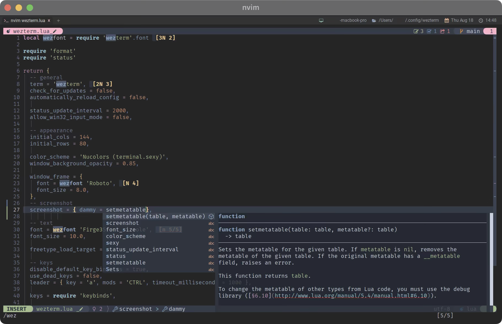

# Introduction
このページでは、わたしが普段使っているターミナル環境を元にした設定例を紹介しています。



*Screenshot of wezterm on macOS, running Neovim and etc...*

全ての設定を網羅しているわけではなく、あくまで自分で使っている設定に対しての解説です。

見てくれた人のヒントになったり、何かの役に立ったりしたら嬉しいです😊


```admonish note title="このサイトが想定している読者"
目安として、`Homebrew` などのコマンド操作ができる程度を想定しています。(ファイル操作から一歩踏み出せてるイメージ)

`WezTerm`の設定については、ほぼ`lua`ファイルの編集で完結するため、ターミナルコマンドを使う場面は限られていますし、
例示も全て行っているつもりではありますが、それでもコマンドを使って操作したことがない場合はやはり怖いです。

逆に、ファイルの編集自体は`vim`などのターミナル上で動くソフトウェアではなく、`Xcode`や`Visual Studio Code`などでも構いません。
これについては`3.Base File`で示します。
```

```admonish warning title="使用環境"
わたしの使用している環境が`macOS`なので、説明やイメージも主にこれを使用しています。

必要なソフトウェアと設定さえ整っていれば 他の OS でも通用するはずですが、
100% 自信を持っているわけではないので、その点ご了承ください。
```

## Thanks
**Thanks to application developers!! I enjoy using it💓**

```admonish info title="Link"
[WezTerm - Wez's Terminal Emulator](https://wezfurlong.org/wezterm/)

[Neovim - hyperextensible Vim-based text editor](https://neovim.io)

[starship - cross-shell prompt](https://starship.rs)
```

**And thanks to the developers of the applications used to create this website🤗**

```admonish info title="Link"
[mdBook](https://rust-lang.github.io/mdBook/)

[Catppuccin for mdBook](https://github.com/catppuccin/mdbook)

[mdbook-admonish](https://github.com/tommilligan/mdbook-admonish)

[DeepL](https://www.deepl.com/translator)
```
