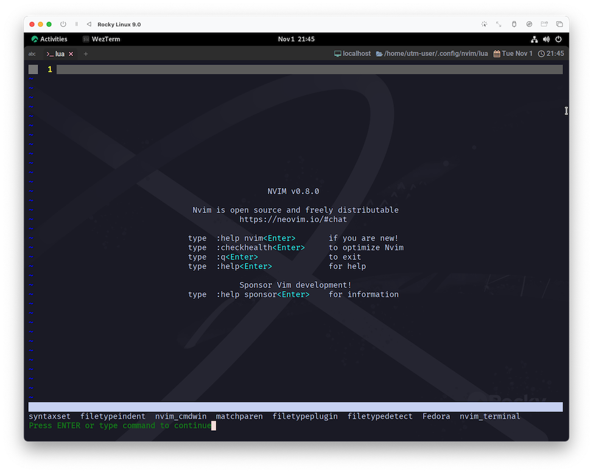
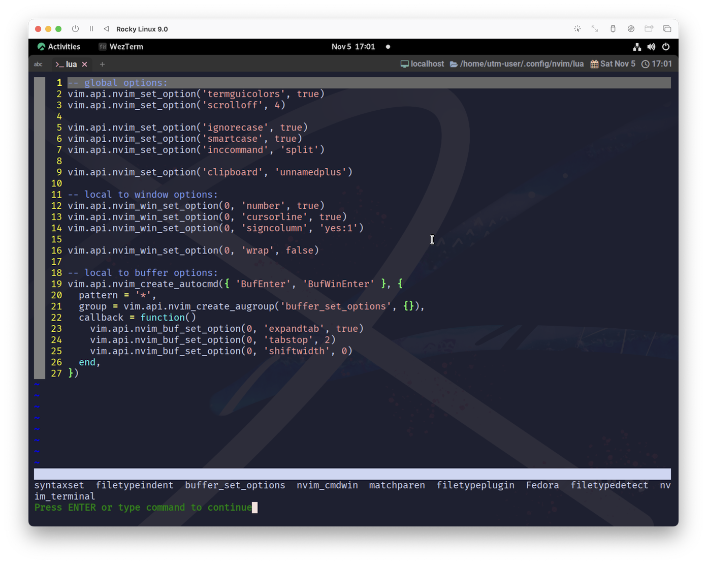

# nvim_create_augroup

うん。とりあえず、何よりもまずはっきりさせておきたいのは、`au`というのは`autocmd`の先頭2文字からきているようですね。
いや、なんか...、どうしても三太郎CMを思い浮かべてしまうので...🍑

...え❓ わたしだけ😧⁉️ 絶対嘘だ❗

~~~admonish info title=":h nvim_create_augroup"
```
nvim_create_augroup({name}, {*opts})                   *nvim_create_augroup()*
    Create or get an autocommand group |autocmd-groups|.
    オートコマンドグループを作成または取得する。

    Parameters:  
      • {name}  String: The name of the group
                        グループの名前

      • {opts}  Dictionary Parameters
                • clear (bool) optional: defaults to true. Clear existing
                  commands if the group already exists |autocmd-groups|.

                  デフォルトはtrue。グループが既に存在する場合、そのコマンドをクリアする。

    Return:  
        Integer id of the created group.
        作成されたグループの整数値 ID

    See also:  
        |autocmd-groups|
```
~~~

`See also`って言われてるんで見ておきましょう😺

~~~admonish info title=":h autocmd-groups"
```
Autocommands can be put together in a group. 
This is useful for removing or executing a group of autocommands.

オートコマンドは、グループとしてまとめることができます。
これは、オートコマンドのグループを削除したり実行したりするのに便利である。
```
~~~

オートコマンドは以下で確認できます。コードをいじる前の現状を確認しておきましょう😌

~~~admonish quote
```
:aug
```
または
```
:augroup
```
~~~



こんな感じですね😌

それでは話を進めるんですが、さっきのヘルプ中に、コードが例示されていましたね。

~~~admonish info title=":h nvim_create_augroup"
```
To get an existing group id, do:  
既存のグループ ID を取得するには、次のようにする。 

    local id = vim.api.nvim_create_augroup("MyGroup", {
        clear = false
    })
``` 
~~~

"既存の"って言われると、「なんで😮❓」ってなるんですけど、
"オートコマンドグループを作成または取得する。"という最初の文言を信じることにしましょう。`create_augroup`なんだし❗

パラメータは`name`には自分で決めたグループ名を、`opts`は...。更に話が長くなっちゃうんで空っぽ(デフォルト)にしときましょう。

```admonish note
`opts`は`clear`オプションを含んでいますが、
「なんでわざわざ`augroup`作らなきゃダメなの？」っていう疑問と密接な関係がありそうです。

なんとな〜く察するに、「二重登録を防ぐためにある程度まとめて制御できた方がいいでしょ❓」的なことらしいんですが...、
わたしはいまひとつわかってません❗

ちなみに`clear`のデフォルト値は`true`なので安全は担保されています。(意味を理解していれば、なんですけどね😅)
```

ってことで、こんな感じのコードになるのかな。

グループの命名規則がわかりませんが、とりあえず雰囲気で...🤫

```lua
local id = vim.api.nvim_create_augroup("buffer_set_options", {})
``````

これを`nvim_create_autocmd`に組み込むので、もう一回ヘルプを確認します。

~~~admonish info title=":h nvim_create_autocmd"
```
  • {opts} Dictionary of autocommand options:
    • group (string|integer) optional: the autocommand group name or id to match against.
      マッチするオートコマンドグループ名または ID。
```
~~~

`nvim_create_augroup`が返してくれる`ID`をそのまま渡せば良さそうですね。

じゃあ、こんな感じでどうかな😆

~~~admonish example title="options.lua"
```lua
-- local to buffer options:
vim.api.nvim_create_autocmd({ 'BufNew', 'BufNewFile', 'BufReadPre', 'FilterReadPre', 'FileReadPre' }, {
  pattern = '*',

  -- groupを追加する
  group = vim.api.nvim_create_augroup('buffer_set_options', {}),

  callback = function()
    vim.api.nvim_buf_set_option(0, 'expandtab', true)
    vim.api.nvim_buf_set_option(0, 'tabstop', 2)
    vim.api.nvim_buf_set_option(0, 'shiftwidth', 0)
  end,
})
```
~~~



`buffer_set_options`の姿を確認できましたね❗これでもう完璧です😆

~~~admonish note
実はわたし、`autocmd`とか今まで全く触ってきてなくて、ず〜っと

```
-- なぜかうまく行く呪文 (2つ目以降のbufferもへーき)
vim.opt.tabstop = 2
```

とかして誤魔化してたんです。

でも、この辺りのページを作るにあたって考え直して、ようやく見栄えのするコードに辿り着けたので、なんかホッとしてます☺️

これなら公開できるでしょ🤗
~~~

```admonish success
つよい　トレーナーに　なったな❗
```

```admonish success title=""
おまえが　nvim　チャンピオン

をめざす❗　といっても
```

```admonish success title=""
だれも　わらわない❗　おうえんするぜ
```
