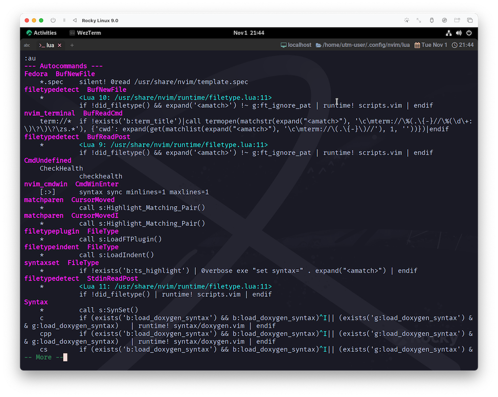
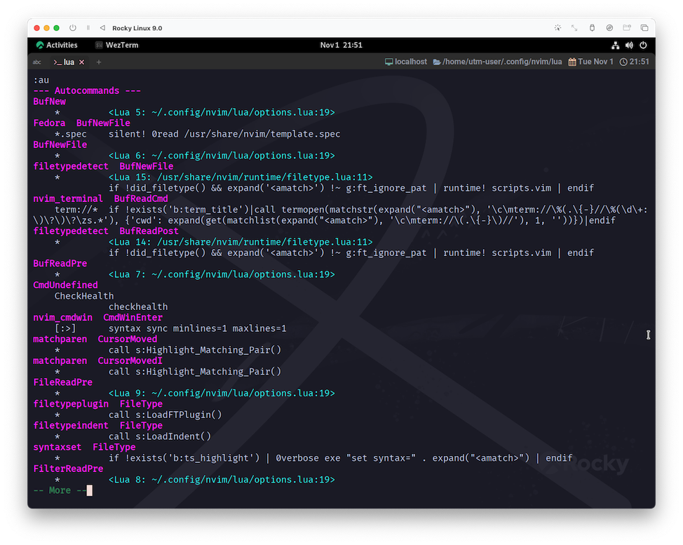

# nvim_create_autocmd

いつだっておじさんは熱くアドバイスしてくれます☺️

~~~admonish info title=":h nvim_create_autocmd"
```
nvim_create_autocmd({event}, {*opts})                   nvim_create_autocmd()
                                        Create an |autocommand|

    The API allows for two (mutually exclusive) types of actions to be
    executed when the autocommand triggers: a callback function (Lua or
    Vimscript), or a command (like regular autocommands).

    このAPIでは、オートコマンドのトリガー時に実行されるアクションとして、
    コールバック関数（LuaまたはVimscript）、またはコマンド（通常のオートコマンドと同様）の
    2種類（相互に排他的）を指定することができる。
```

```lua
    -- Example using callback:

      local myluafun = function() print("This buffer enters") end

      vim.api.nvim_create_autocmd({"BufEnter", "BufWinEnter"}, {
        pattern = {"*.c", "*.h"},
        callback = myluafun,
      })
```
~~~

ヘルプではもっと色々なサンプル付きで説明されていますが、今回はここで切り上げます😅

`nvim_create_autocmd`の中に記述が見つかる`callback`からいきます。抜粋すると以下です。

~~~admonish info title=":h nvim_create_autocmd"
```
Lua function which is called when this autocommand is triggered. Cannot be used with {command}.

このオートコマンドが起動した際に呼び出されるLua関数です。{コマンド}とは併用できません。
```
~~~

次は一個手前の`pattern`を確認してみます。これは`file-pattern`として説明されています😌

~~~admonish info title=":h file-pattern"
```
The pattern is interpreted like mostly used in file names:
このパターンは、ファイル名によく使われるものと同じように解釈されます。

  *         matches any sequence of characters; Unusual: includes path separators
  ?         matches any single character
  \?        matches a '?'
  .         matches a '.'
  ~         matches a '~'
  ,         separates patterns
  \,        matches a ','
  { }       like \( \) in a |pattern|
  ,         inside { }: like \| in a |pattern|
  \}        literal }
  \{        literal {
  \\\{n,m\} like \{n,m} in a |pattern|
  \         special meaning like in a |pattern|
  [ch]      matches 'c' or 'h'
  [^ch]     match any character but 'c' and 'h'
```
~~~

で、最初に戻ってきて`event`なんですが、`autocmd-events`がこれでしょう🤔

~~~admonish info title=":h autocmd-events"
```
5. Events					*autocmd-events* *E215* *E216*

You can specify a comma-separated list of event names.  No white space can be
used in this list.  The command applies to all the events in the list.

イベント名のリストをカンマ区切りで指定することができる。
このリストには空白を使用できない。コマンドは、リスト内のすべてのイベントに適用される。

For READING FILES there are four kinds of events possible:
ファイル読み込みでは、4種類のイベントが考えられる:

	BufNewFile                    starting to edit a non-existent file
	BufReadPre BufReadPost        starting to edit an existing file
	FilterReadPre FilterReadPost  read the temp file with filter output
	FileReadPre FileReadPost      any other file read

Vim uses only one of these four kinds when reading a file.  The "Pre" and
"Post" events are both triggered, before and after reading the file.

Vim はファイルを読み込むとき、これら 4 種類のうち 1 つだけを使用する。
Pre" と "Post" イベントは、ファイルを読む前と読んだ後の両方がトリガーされます。
```
~~~

```admonish info title=""
(この後イベントの説明がズラ〜っと並んでいるんですが、とにかく量が多いので以下略❗)
```

ここでやりたいことは、

- `event`: バッファを作る・開くする際に

- `pattern`: 全てのファイル(パターン)に対して

- `callback`: `local to buffer`の設定をする

...です。

`event`については、奇⭐︎跡⭐︎的🌟 に❗ヘルプ内で例示を行ってくれていたので、そのまま採用します。(助かったぁ😆)

ただ、これだけだと単純に`nvim`(ファイル指定無し)として起動したケースでうまく行かなかったので、`BufNew`も加えました。

あとはもう、`pattern`は簡単だし、`callback`はもう既に書いたコードを持ってくれば良いだけですね😉

~~~admonish example title="options.lua"
```lua
vim.api.nvim_create_autocmd({ 'BufNew', 'BufNewFile', 'BufReadPre', 'FilterReadPre', 'FileReadPre' }, {
  pattern = '*',
  callback = function()
    -- 10.3.1 節で書いたコードをここに移動する
    vim.api.nvim_buf_set_option(0, 'tabstop', 2)
    vim.api.nvim_buf_set_option(0, 'shiftwidth', 0)
    vim.api.nvim_buf_set_option(0, 'expandtab', true)
  end,
})
```
~~~

```admonish note
`FilterReadPre`と`FileReadPre`が必要になるのかが判然としませんが、特に害は無さそうなので、このままいきます😅
```

~~~admonish tip
`pattern`のデフォルトは`'*'`らしいので、実は省略できちゃいます😉
~~~

では、これがちゃんと登録されることを実際に確認してみましょう。

`nvim`を再起動する前に、以下のコマンドを実行してみてください。

~~~admonish quote 
```
:au
```

または

```
:autocmd
```
~~~



こんな感じに出てきたでしょうか。

```admonish note
スクリーンショットの環境が突然変わったことは気にしないでください😺
```

それでは、`nvim`を再起動して、もう一度同じ`:au`を実行してみましょう...。



`options.lua`に書いたイベントが登録されていることが確認できましたね❗

編集画面に戻って適当にタブ入力をしてみてください。タブ幅の設定は反映されていますか❓

...されてますよね⁉️

```admonish success
ここまで来れば、とりあえずは期待する動作が得られているはずです😆

...、あ、いえ。"とりあえず" と言っているのには理由があって...。

でも、なんだか長くなってきたので、もう一回だけ続く...❗🙀

(疲れたらちゃんと休憩とってね☕)
```
