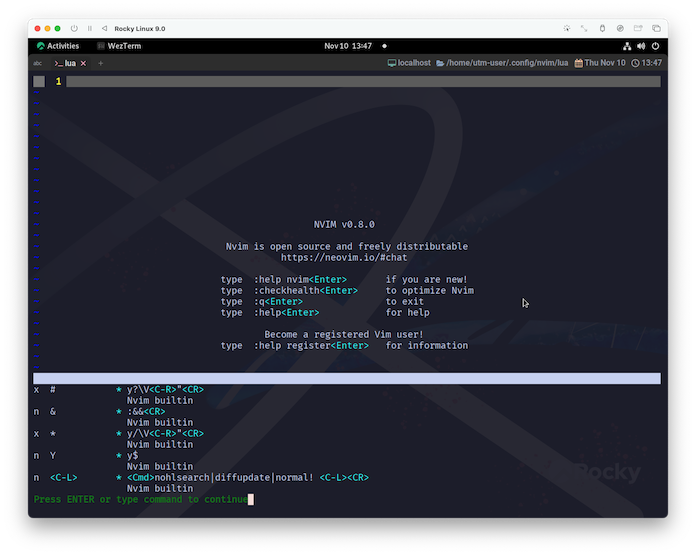

# Set

この節ではキーマップをカスタマイズする方法を見ていきましょう。

## keymap.set()

~~~admonish info title = ":h keymap.set"
```
set({mode}, {lhs}, {rhs}, {opts})                           vim.keymap.set()
    Add a new |mapping|. Examples:  
    新しい|mapping|を追加します。

    Parameters:  
      • {mode}  string|table Same mode short names as |nvim_set_keymap()|. Can
                also be list of modes to create mapping on multiple modes.
                
                |nvim_set_keymap()| と同じモードのショートネーム。
                複数のモードに対してマッピングを作成するために、モードのリストを指定することもできる。

      • {lhs}   (string) Left-hand side |{lhs}| of the mapping.
                マッピングの左辺|{lhs}|。

      • {rhs}   string|function Right-hand side |{rhs}| of the mapping. Can
                also be a Lua function.

                マッピングの右辺|{rhs}|。Luaの関数でも可。

      • {opts}  (table|nil) A table of |:map-arguments|.
                • Accepts options accepted by the {opts} parameter in
                  |nvim_set_keymap()|, with the following notable differences:
                  • replace_keycodes: Defaults to `true` if "expr" is `true`.
                  • noremap: Always overridden with the inverse of "remap" (see below).

                • In addition to those options, the table accepts the
                  following keys:
                  • buffer: (number or boolean) Add a mapping to the given
                    buffer. When `0` or `true`, use the current buffer.
                  • remap: (boolean) Make the mapping recursive. This is the
                    inverse of the "noremap" option from |nvim_set_keymap()|.
                    Defaults to `false`.

                • |nvim_set_keymap()| の {opts} パラメータで受け付けられるオプションを受け付けるが、以下の顕著な違いがある。
                  • replace_keycodes: replace_keycodes: "expr" が `true` の場合、デフォルトは `true` 。
                  • noremap: noremap: "remap "の逆で常にオーバーライドされる(下記参照)。

                • これらのオプションに加え、テーブルでは以下のキーを受け付ける。
                  • buffer: (number or boolean) 与えられたバッファにマッピングを追加する。
                    '0` または `true` の場合、現在のバッファを使用する。
                  • remap: (boolean) マッピングを再帰的に行う。これは |nvim_set_keymap()| の "noremap" オプションの逆バージョンである。
                    デフォルトは `false` 。

    See also:  
        |nvim_set_keymap()|
```
~~~

`{mode}`の`short names`はこっち。

~~~admonish info title = ":h nvim_set_keymap"
```
    Parameters:  
      • {mode}  Mode short-name (map command prefix: "n", "i", "v", "x", …) or
                "!" for |:map!|, or empty string for |:map|.
```
~~~

[Neovim Discourse](https://neovim.discourse.group/t/what-exactly-changed-in-nvim-get-keymap/1881)の会話を盗み見た🤫感じだと、
`vim.keymap.set()`は`vim.api.nvim_set_keymap()`の`Syntactic sugar`[^1]だと思われます。

```admonish note
ここまでひたすら`vim.api`を使用してきたので、`vim.api.nvim_set_keymap()`を使用する方が統一感は出そうなんですが、記述が難しくなってしまうのは避けたい...。

...と、言うわけで`vim.keymap.set()`を使って行くことにします😉
```

## Customize

実際に動かしてみましょう☺️

この先に出てくる、`<Up>`とか`<C-…>`だったりの表記が、どのキーを指しているのか❓などの一覧は`key-notation`として説明されています。

~~~admonish info title=":h key-notation"
```
					                            key-notation key-codes keycodes
These names for keys are used in the documentation. 
They can also be used with the ":map" command.

これらのキーの名前は、ドキュメントで使用されています。
これらは ":map" コマンドで使用することもできます。
```
~~~

~~~admonish tip
上のヘルプの内容とは少し離れますが、`:map`コマンドを使用すると現在のキー設定が一覧できます。

```
:map
```


~~~

### 割り当て

~~~admonish example title="keybinds.lua"
```lua
vim.keymap.set('n', '<Up>', '<C-y>')
vim.keymap.set('n', '<Down>', '<C-e>')
```
~~~

これを記述してから再起動すると、方向キーの上下でスクロールするようになっているはずです。
(適当に2行以上入力してから試してください。)

上のコードが何をしているかと言うと、

```
ノーマルモードの時に, <上>キーが入力されたら, <Ctrl+y>キーの操作として受け付けるぞぉ❗
ノーマルモードの時に, <下>キーが入力されたら, <Ctrl+e>キーの操作として受け付けるぞぉ❗
```

ってことですね。

「`キー操作に機能`を割り当てる」と言うよりは、「`キー操作にリンク先のキー`を割り当てる 」というニュアンスかもしれません。

```admonish note
ヘルプの中で、右辺には`lua`関数でも可。の部分に当たる「`キー操作に機能`を割り当てる」については、次の章で😉
```

ここでは一度、実際に動くことを確認してもらいたかったので`keybinds.lua`のサンプルとして提示しましたが、

「こんな感じね〜」を掴めたら削除してもらって構いません。

この後は雰囲気だけ味わってもらえればいいかな〜、ぐらいで流します。軽〜く眺めてください😌

```admonish note
この先、いくつか例示はしますが、ご自身の環境に組み入れるかどうかは任意で❗
```

### 入れ替え

「相互に操作を入れ替える」みたいなパターンも、たったこれだけ😸

~~~admonish quote title=""
```lua
vim.keymap.set('n', ';', ':')
vim.keymap.set('n', ':', ';')
```
~~~

`:`は説明が長くなるので省略してしまうんですが、`;`でコマンドモードに入れるようになります。

### 無効化

無効化するパターンもあります。

~~~admonish quote title=""
```lua
vim.keymap.set('n', 'ZZ', '<NOP>')
vim.keymap.set('n', 'ZQ', '<NOP>')
```
~~~

`<NOP>`についてはヘルプに記載されていましたね。

~~~admonish info title=":h key-notation"
```
<NOP>   no-op: do nothing (useful in mappings)	<Nop>
               何もしない（マッピングで有効）
```
~~~

`ZZ`は保存して終了、`ZQ`は保存しないで終了、...というのがデフォルトの動作ですが、これをそれぞれ無効化しています。

いや、なんか...、ノーマルモードから急に終了したら怖くないですか...😱

### モード

ここまでは全てノーマルモードでの例でしたが、もちろん他のモードでのカスタマイズもできます。

~~~admonish quote title=""
```lua
vim.keymap.set('i', 'jj', '<Esc>')
```
~~~

```admonish warning
自分は使っておいてアレですが、かなりのクセつよなのでおすすめしないし、説明も少し長くなるので省略しちゃうんですがごめんなさい...😿
```

`{mode}`(第一パラメータ)をもう少し詳しく見ると、こんな感じです。

~~~admonish info title=":h map-table"
```
              map-table
         Mode  | Norm | Ins | Cmd | Vis | Sel | Opr | Term | Lang |  
Command        +------+-----+-----+-----+-----+-----+------+------+  
[nore]map      | yes  |  -  |  -  | yes | yes | yes |  -   |  -   |
n[nore]map     | yes  |  -  |  -  |  -  |  -  |  -  |  -   |  -   |
[nore]map!     |  -   | yes | yes |  -  |  -  |  -  |  -   |  -   |
i[nore]map     |  -   | yes |  -  |  -  |  -  |  -  |  -   |  -   |
c[nore]map     |  -   |  -  | yes |  -  |  -  |  -  |  -   |  -   |
v[nore]map     |  -   |  -  |  -  | yes | yes |  -  |  -   |  -   |
x[nore]map     |  -   |  -  |  -  | yes |  -  |  -  |  -   |  -   |
s[nore]map     |  -   |  -  |  -  |  -  | yes |  -  |  -   |  -   |
o[nore]map     |  -   |  -  |  -  |  -  |  -  | yes |  -   |  -   |
t[nore]map     |  -   |  -  |  -  |  -  |  -  |  -  | yes  |  -   |
l[nore]map     |  -   | yes | yes |  -  |  -  |  -  |  -   | yes  |
```

`Vimscript`準拠の表記になっていますが、先頭文字がそれぞれ`vim.keymap.set`の`{mode}`に対応しています。
~~~

冒頭の例で言うと、`'i'`はインサートモードを指しています。

また、複数のモードに対して適用するのであれば以下のようになります。

~~~admonish quote title=""
```lua
vim.keymap.set({ 'n', 'v' }, 'p', 'p`]')
```
~~~

`{ 'n', 'v' }`はノーマルモードとビジュアルモードに適用する、というものになっています。

```admonish note
正確に言うと、上の表を参照するとわかる通り、さらにセレクトモードにも適用されることになります。
```

## まとめ

改めて`:map`で確認してみると、こんな感じで設定した内容が反映されていることが確認できます。


```admonish question
insert モードの内容が表示されないのは...なんで❓😮
```

キーカスタマイズに関しては、Web上で色々な人が実用的なアイデアを公開しているので、色々試してみると良いです☺️

~~~admonish tip
上のスクリーンショットにも入っているんですが、これとかは結構便利です。

```lua
vim.keymap.set('n', 'x', '"_x')
vim.keymap.set('n', 'X', '"_X')
vim.keymap.set('n', 's', '"_s')
```

これらは「1文字消して〜」のキーですが、こうすると消した文字をレジスタに入れず、純粋に文字を消すだけの動作になります。

...って、ちょっと紹介したい欲が出てしまった🙀
~~~

```admonish warning
念の為明示しておくんですが、このページに挙げた例もWebなどでわたしが見たアイデアをマネしてます。

実際に誰をマネしているのかがもう分からなくなっているので、ちゃんと参照元を示せない点は、ごめんなさい🥹

「これはわたしが発案してます😆」みたいに見えちゃうのは絶対に望んでないです。
```

```admonish success
ほんとしつこいようなんですけど、結局キーマップのカスタマイズは個人の感覚に依るので、根拠らしい根拠とかも出てこないんですよね😅

ただ、もう少し進むと「もう嫌❗🙀」ってなるぐらい実用的なキーカスタマイズに触れて行くことになります。

ここでは雰囲気だけ掴めれば、ほんと充分です😉
```

```admonish success title=""
<div style="text-align: center">

  KEYMAP WILL RETURN

  キーマップは帰ってくる
</div>
```

[^1]: シンタックスシュガーについては[ja.wikipedia.org](https://ja.wikipedia.org/wiki/糖衣構文)に丸投げします😃
