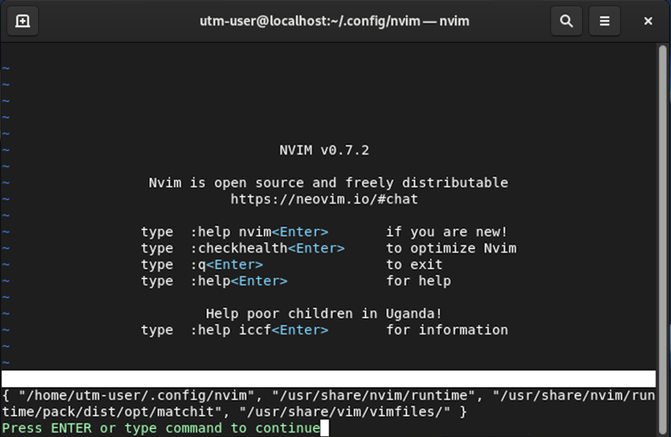
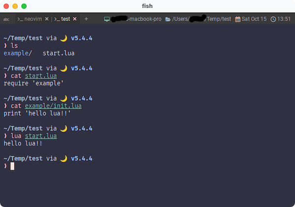
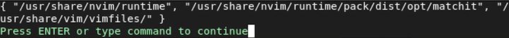

# Lua Module
なんと、これに関しては既に日本語に訳されたドキュメントが存在します。

登っていきましょうとか言っておいてなんですが、まずは掘り下げちゃいます。どんまい😆

```admonish info title="[モジュール](https://github.com/willelz/nvim-lua-guide-ja/blob/master/README.ja.md#モジュール)"
Luaモジュールは、runtimepath内のlua/フォルダにあります
(ほとんどの場合、*nixでは~/.config/nvim/lua、Windowsでは~/AppData/Local/nvim/luaを意味します)。

このフォルダにあるファイルをLuaモジュールとしてrequire()できます。
```

## runtimepath
一個ずつ見ていきますが、`runtimepath`は`Neovim`で以下のコマンドを使用することで確認できます。

~~~admonish quote title="runtimepathを確認"
```lua
:lua print(vim.inspect(vim.api.nvim_list_runtime_paths()))
```
~~~



いきなりちょっと複雑でしたね😅

頑張ってコマンドを打つと、出力の中に `"~/.config/nvim"`があるはずです。[^not-config]

(上の例は`unix`なので`"/home/utm-user/.config/nvim"`)

```admonish note
補足しておくと、OSによってホームディレクトリは違いますが、`~`や`$HOME`を使ってアクセスできます。
```

ここに`lua`ディレクトリを作成することで、上に示されている「ほとんどの場合」に合致できます。

~~~admonish quote title="luaディレクトリを作る"
```sh
mkdir ~/.config/nvim/lua
```
~~~

あと、`runtimepath`絡みでもう一つポイントがあります。

~~~admonish info title="[Runtime files](https://github.com/willelz/nvim-lua-guide-ja/blob/master/README.ja.md#runtime-files)"
runtimepath内にある特定のフォルダからLuaファイルを自動的に読み込めます。 現在、次のフォルダがサポートされています。

- colors/
- compiler/
- ftplugin/
- ftdetect/
- indent/
- plugin/
- syntax/
~~~

逆に言うと、`lua`ディレクトリは自動では読み込まないぞ❗ということですね。

`lua`ディレクトリに置いたファイルは`~/.config/nvim/init.lua`から`require()`で読み込んでいきましょう。

## require()

`require()`は`WezTerm`でも使いましたね。

`WezTerm`の時は`wezterm.lua` と同じディレクトリにあるファイルを読み込むことにしか使用していませんでしたが、
もうちょっと高機能です。

~~~admonish info title="[モジュール](https://github.com/willelz/nvim-lua-guide-ja/blob/master/README.ja.md#モジュール)"
次のLuaコードはmyluamodule.luaをロードします。:
```lua
require('myluamodule')
```
.lua拡張子がないことに注意してください。

同様に、other_modules/anothermodule.lua のロードは次のように行います。:
```lua
require('other_modules.anothermodule')
-- or
require('other_modules/anothermodule')
```
パスの区切りはドット.またはスラッシュ/で示されます。

フォルダにinit.luaが含まれている場合、ファイル名を指定せずにロードできます。
~~~

~~~admonish tips
最後の一文は、
```lua
require('example') 
```
とした場合に`example/init.lua`をロードできるよ❗ってことですね。これは`Neovim`に限ったものではなく、`Lua`の仕様みたいです。

全く関係ないところでやってみてもこの説明で通用するものになりました。


~~~

```admonish success
どう？この流れ🐮

能書きとしてはこんな感じじゃないでしょうか。

これだけ分かれば、あとはもうカスタマイズを書き加えていくだけですね😄
```

[^not-config]: `~/.config/nvim`ディレクトリが存在しないと`runtimepath`からもいなくなるようです。ディレクトリの存在を事前に確認してる?🤔

