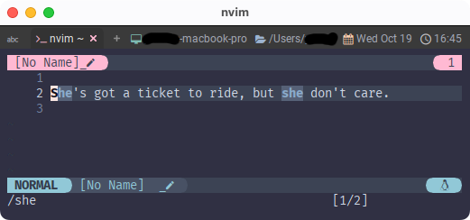
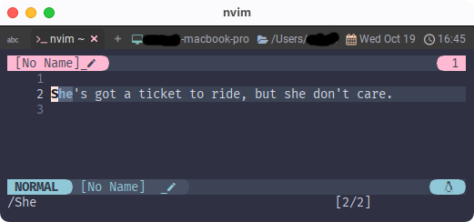

# ignorecase / smartcase

この2つは検索に関するオプションなのでまとめていっちゃいます😆

~~~admonish info title=":h ignorecase"
```
7. Ignoring case in a pattern					/ignorecase

If the 'ignorecase' option is on, the case of normal letters is ignored.
'smartcase' can be set to ignore case when the pattern contains lowercase
letters only.

ignorecase' オプションがオンの場合、通常の文字の大文字小文字は無視される。
smartcase' を指定すると、パターンが小文字のみである場合に大文字小文字を無視する。

Examples:
      pattern	'ignorecase'   'smartcase'   matches  

    	foo         off		    -	    foo
	    foo	    on		    -	    foo Foo FOO
	    Foo	    on		    off	    foo Foo FOO
	    Foo	    on		    on	    Foo
	    \cfoo	    -	            -	    foo Foo FOO
	    foo\C	    -	            -	    foo
```
~~~

~~~admonish info title=":h smartcase"
```
'smartcase' 'scs' 'nosmartcase' 'noscs'

'smartcase' 'scs' boolean (default off)
			      global

    Override the 'ignorecase' option if the search pattern contains upper
    case characters.  Only used when the search pattern is typed and
    'ignorecase' option is on. 

    検索パターンが大文字を含む場合、'ignorecase' オプションを無効にする。
    検索パターンが入力され、'ignorecase' が on の時のみ使用される。
```
~~~

~~~admonish example title="options.lua"
```lua
vim.api.nvim_set_option('ignorecase', true)
vim.api.nvim_set_option('smartcase', true)
```
~~~

これは実際に動かしてみましょう😉 まずは以下の文章を入れてみて下さい。

```admonish abstract title="文章例"
She's got a ticket to ride, but she don’t care.
```

「彼女がおれのことなんて気にも留めずに行っちゃうよ！」...っていう
[Ticket to Ride](https://en.wikipedia.org/wiki/Ticket_to_Ride_(song))の一節です。[^1]

それでは小文字だけの`she`を検索してみます。検索には`/`で入れます。

```
/she
```


`She`と`she`の2つに反応しましたね。

じゃあ、次は 「大文字を含む場合」の`She`でやってみましょう。

```
/She
```


`She`だけに反応しましたね。

要は、「大文字が含まれていれば大小区別するけど、含まれてないなら大小無視するよ。」ってことですね。

```admonish note
ちなみに、`/sHe`と検索すると`sHe`にだけ反応します。

先頭かどうかに関わらず大文字を含んでいるからっていう理屈ですね。
```

```admonish success
なんか色々難しく書いてあるので不安になりますが、動かしてみれば簡単ですね☺️
```

[^1]: あ❗これは[HELP! - The Beatles](https://en.wikipedia.org/wiki/Help!) の収録曲ですね❗
なんかこの辺ヘルプばっかりじゃね⁉️ってなる、ウケる〜🤣 ...そうでもないかぁ😮
