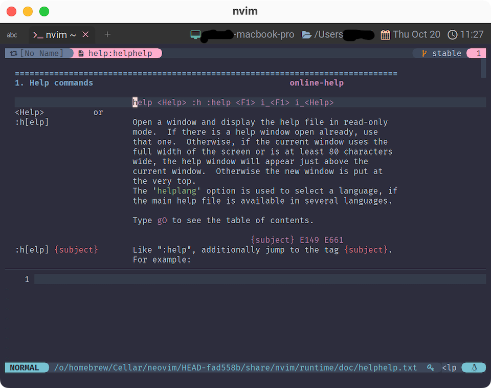

# Options

じゃあ、いつも通りのところから始めていきます☺️

`lua`ディレクトリに`options.lua`とでもしてファイルを作成しましょう。

~~~admonish quote title="lua/options.luaを作る"
```sh
nvim lua/options.lua
```
~~~

で、`init.lua`から`require()`するんでしたね。

~~~admonish example title="init.lua"
```lua
require 'options'
```
~~~

もうバッチリですね🤗

## help

これ...、超重要なやつなんで...。

心して...! `Neovim`のコマンドから打ってください...!!

~~~admonish quote title=""
```
:h help
```
もしくは
```
:help help
```
~~~



`help`のヘルプが開きましたね🤣

```admonish note
このサイトではヘルプコマンドを`:h`で表記していきますが、好きなほうでいいです😸
```

色々書いてありますが、とりあえずはこれだけ覚えていればOK❗重要だぞ😉❤️

~~~admonish info title=":h help"
```
:h[elp]                 Open a window and display the help file in read-only mode.
                        ウィンドウを開き、ヘルプファイルを読み込み専用で表示する。

                        Type |gO| to see the table of contents.
                        目次を見るには、gO (←大文字のアルファベットO) とタイプする。

:h[elp] {subject}	Like ":help", additionally jump to the tag {subject}.
                        help" と同様に、{subject} というタグにジャンプする。

                        For example:   
                            :help options

                        If there is no full match for the pattern, or there
                        are several matches, the "best" match will be used.
                        A sophisticated algorithm is used to decide which
                        match is better than another one.

                        パターンに完全一致するものがない場合、または複数の一致するものがある場合は、
                        「最良の」一致するものが使用される。。どのマッチが他のマッチより優れているか
                        を決定するために、洗練されたアルゴリズムが使用される。
```
~~~

`:h`でやるとトップページ。`:h {subject}`とやるとヘルプを検索してヒットしたタグにジャンプ。ということですね。

今回は後者でした。`help`タグに直接飛びましたね。

閉じるときは`:q`とか`:bd`でいいんですが、頑張りすぎて ぐちゃぐちゃ になっちゃう時があるので、
併せて`:helpc`(or `:helpclose`)も覚えておくと安心です☺️

~~~admonish info title=":h helpc"
```
:helpc[lose]    Close one help window, if there is one.
			    Vim will try to restore the window layout (including
			    cursor position) to the same layout it was before
			    opening the help window initially.

                ヘルプウィンドウがある場合、それを閉じる。
                Vim は、ウィンドウのレイアウト（カーソル位置も含む）を、
                最初にヘルプウィンドウを開く前と同じレイアウトに戻そうとする。
```
~~~

ヘルプの使い方さえわかってしまえば、もうこっちのもんですね🤗

```admonish success
おいっ❗
```

```admonish success title=""
きみは　いま❗
```

```admonish success title=""
nvimちほう　への

だいいっぽを　ふみだした❗
```

```admonish success title=""
なんだったら　タウンマップで

かくにんして　ごらん❗
```
