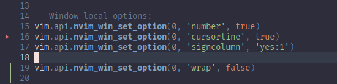
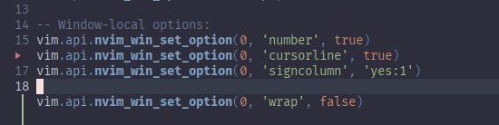
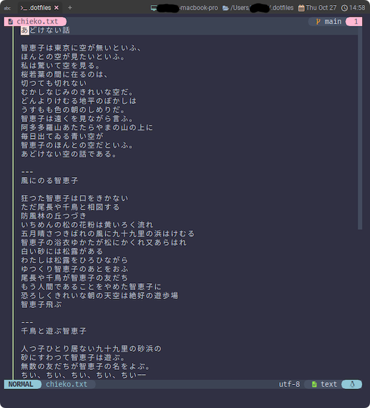

# signcolumn

この段階で出てこられても、ちょっと説明に困る部分もあるんですが...。

まあ、外観に影響する部分なので、先にやっちゃうことにします😉

~~~admonish title=":h signcolumn"
```
						            'signcolumn' 'scl'

'signcolumn' 'scl'      string      (default "auto")
			            local to window

	When and how to draw the signcolumn. Valid values are:
    記号列をどのように描画するか。有効な値は以下の通り。

	    "auto"   	only when there is a sign to display
                        表示する sign がある場合のみ表示する

	    "auto:[1-9]"    resize to accommodate multiple signs up to the
                        指定された数まで複数のサインを収容するためにリサイズする
	                    
	    "auto:[1-8]-[2-9]"
                        resize to accommodate multiple signs up to the
                        given maximum number (maximum 9) while keeping
                        at least the given minimum (maximum 8) fixed
                        space. The minimum number should always be less
                        than the maximum number.

                        与えられた最小値（最大8）以上の固定スペースを維持しながら、
                        与えられた最大数（最大9）までの複数のサインを収容するためにリサイズする。
                        最小数は常に最大数より小さくなければならない。

	    "no"	        never
                        常に表示しない

	    "yes"           always
                        常に表示する

	    "yes:[1-9]"     always, with fixed space for signs up to the given number (maximum 9)
                        常に、与えられた数（最大9）までの標識のための固定スペースを持つ

	    "number"        display signs in the 'number' column. If the number
			            column is not present, then behaves like "auto".
                        "番号" の欄に column を表示する。
                        番号列が存在しない場合は、"auto" と同じように動作する。
```
~~~

大まかにいえば3通りがあって、

`auto`(デフォルト)にしておくか...、

`yes`か`no`で決め打つか...、

ややクセのある`number`か...、

ですね。

`auto`は表示と非表示が動的に切り替わるので、編集中にぺこぱこすることがあります。
わたしは固定しちゃう方が好きです😆

~~~admonish example title="options.lua"
```lua
vim.api.nvim_win_set_option(0, 'signcolumn', 'yes:1')
```
~~~



```admonish note
`yes:1`と`yes`は見た感じ同じなんですが...、んー、なんか一応😅
```

`number`はこんな感じになります。



`gitsigns.nvim`[^1]というプラグイン[^2]を使用して、変更箇所を`signcolumn`に表示しています。

(▶︎ とか ▎の部分がそれです。)

`yes`と比べて違いは明らかですね😆 行番号に優先してコラムを表示してます。

まあこれくらいなら、なんか見た目的に面白いなーと思うんですが、
`Untracked file`とか開くと行番号が全部隠れちゃうので、やっぱクセつよですよね...。



```admonish success
次は、上のスクリーンショットで一足早く登場してしまった`wrap`を片付けちゃいます😌
```

[^1]: [https://github.com/lewis6991/gitsigns.nvim](https://github.com/lewis6991/gitsigns.nvim)

[^2]: プラグインについてはこのサイトでも取り上げたいんですが、もうちょっとかかりそうです😓
