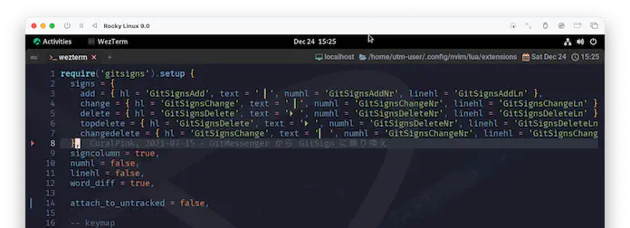
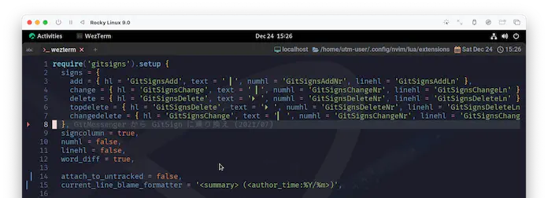

# gitsigns.nvim

今回は`gitsigns.nvim`です。

人によっては`git`を使っていないかもしれないんだけど、これをきっかけに挑戦してみると楽しいと思います。

```admonish info title="[gitsigns.nvim](https://github.com/lewis6991/gitsigns.nvim)"
Super fast git decorations implemented purely in lua/teal.

lua/teal でピュアに実装された超高速な git 装飾。
```

だよねー。もう Christmas🎄 だもんねー😆 華やかな "装飾" を施していきましょう❗

```admonish abstract title="Requirements"
Neovim >= 0.7.0

Note: If your version of Neovim is too old, then you can use a past release.

Neovimのバージョンが古すぎる場合、過去のリリースを使用することができます。

Note: If you are running a development version of Neovim (aka master), then breakage may occur if your build is behind latest.

Neovimの開発版(別名master)を使っている場合、ビルドが最新より遅れていると破損する可能性があります。

Newish version of git. Older versions may not work with some features.

gitの新しいバージョン。古いバージョンでは、一部の機能が動作しない可能性があります。
```

`Neovim`も`git`も、「`stable release`をあえて外している😑」 とかしてなければ気にしなくて平気です。

## Installation

もう意地でも聖夜🌃に間に合わせます。`gitsigns`に負けないくらい超高速でいきましょう😆

今回は色々カスタマイズしていきたいので、
まずは[Usage](https://github.com/lewis6991/gitsigns.nvim#usage)に示されているデフォルトセッティングを入れておくことにしましょう。

これを基に、あとでカスタマイズしていきます。

~~~admonish example title="extensions/gitsigns.lua"
```lua
require('gitsigns').setup {
  signs = {
    add          = { hl = 'GitSignsAdd'   , text = '│', numhl='GitSignsAddNr'   , linehl='GitSignsAddLn'    },
    change       = { hl = 'GitSignsChange', text = '│', numhl='GitSignsChangeNr', linehl='GitSignsChangeLn' },
    delete       = { hl = 'GitSignsDelete', text = '_', numhl='GitSignsDeleteNr', linehl='GitSignsDeleteLn' },
    topdelete    = { hl = 'GitSignsDelete', text = '‾', numhl='GitSignsDeleteNr', linehl='GitSignsDeleteLn' },
    changedelete = { hl = 'GitSignsChange', text = '~', numhl='GitSignsChangeNr', linehl='GitSignsChangeLn' },
    untracked    = { hl = 'GitSignsAdd'   , text = '┆', numhl='GitSignsAddNr'   , linehl='GitSignsAddLn'    },
  },
  signcolumn = true,  -- Toggle with `:Gitsigns toggle_signs`
  numhl      = false, -- Toggle with `:Gitsigns toggle_numhl`
  linehl     = false, -- Toggle with `:Gitsigns toggle_linehl`
  word_diff  = false, -- Toggle with `:Gitsigns toggle_word_diff`
  watch_gitdir = {
    interval = 1000,
    follow_files = true
  },
  attach_to_untracked = true,
  current_line_blame = false, -- Toggle with `:Gitsigns toggle_current_line_blame`
  current_line_blame_opts = {
    virt_text = true,
    virt_text_pos = 'eol', -- 'eol' | 'overlay' | 'right_align'
    delay = 1000,
    ignore_whitespace = false,
  },
  current_line_blame_formatter = '<author>, <author_time:%Y-%m-%d> - <summary>',
  sign_priority = 6,
  update_debounce = 100,
  status_formatter = nil, -- Use default
  max_file_length = 40000, -- Disable if file is longer than this (in lines)
  preview_config = {
    -- Options passed to nvim_open_win
    border = 'single',
    style = 'minimal',
    relative = 'cursor',
    row = 0,
    col = 1
  },
  yadm = {
    enable = false
  },
}
```
~~~

~~~admonish example title="extensions/init.lua"
```lua
use {
  'lewis6991/gitsigns.nvim',
  -- tag = 'release',
  config = function() require 'extensions.gitsigns' end,
}
```
~~~

ってことで、もうすっかりお馴染みの`:PackerSync`😆


もし`git`の管理下に居たのなら、もうこの時点で`sigincolumn`に装飾🎄がされてますね❗yeah!! 🍾

```admonish note
フライングで登場していた[signcolumn](https://coralpink.github.io/commentary/neovim/options/signcolumn.html)
からここまでに2ヶ月かかりました...。

まあなんか、やってやったぜってな感じはあります☺️
```

```admonish warning
`Neovim`の`nightly`ビルドや開発ビルドを実行している場合は、`tag`オプションを使用しないでください!

(Stable Releaseを使用している場合は入れてね!) ...と記載されているのですが、
なぜかアップデート確認(次回以降の`:PackerSync`)で失敗します。


これは`packer`の問題なのかな...。ごめんなさい、今ちょっと高速なんで、また今度確認してみます😣

あ、上の例では既にコメントアウトしてます。
```

## Keymaps

カスタマイズに入る前に、キーマップも入れておきましょう。

キーマップはデフォルトでは有効になっていないようなので、
これも[Keymaps](https://github.com/lewis6991/gitsigns.nvim#keymaps)からそのまま貼り付けちゃいます。

```admonish info title="Keymaps"
Gitsigns provides an on_attach callback which can be used to setup buffer mappings.

Gitsigns は on_attach コールバックを提供し、buffer マッピングの設定に使用することができます。
```

~~~admonish example title="extensions/gitsigns.lua"
```lua
-- require('gitsigns').setup {

-- setup の中にペーストします。

  on_attach = function(bufnr)
    local gs = package.loaded.gitsigns

    local function map(mode, l, r, opts)
      opts = opts or {}
      opts.buffer = bufnr
      vim.keymap.set(mode, l, r, opts)
    end

    -- Navigation
    map('n', ']c', function()
      if vim.wo.diff then return ']c' end
      vim.schedule(function() gs.next_hunk() end)
      return '<Ignore>'
    end, {expr=true})

    map('n', '[c', function()
      if vim.wo.diff then return '[c' end
      vim.schedule(function() gs.prev_hunk() end)
      return '<Ignore>'
    end, {expr=true})

    -- Actions
    map({'n', 'v'}, '<leader>hs', ':Gitsigns stage_hunk<CR>')
    map({'n', 'v'}, '<leader>hr', ':Gitsigns reset_hunk<CR>')
    map('n', '<leader>hS', gs.stage_buffer)
    map('n', '<leader>hu', gs.undo_stage_hunk)
    map('n', '<leader>hR', gs.reset_buffer)
    map('n', '<leader>hp', gs.preview_hunk)
    map('n', '<leader>hb', function() gs.blame_line{full=true} end)
    map('n', '<leader>tb', gs.toggle_current_line_blame)
    map('n', '<leader>hd', gs.diffthis)
    map('n', '<leader>hD', function() gs.diffthis('~') end)
    map('n', '<leader>td', gs.toggle_deleted)

    -- Text object
    map({'o', 'x'}, 'ih', ':<C-U>Gitsigns select_hunk<CR>')
  end
-- }
```
~~~

もう結構`lua`にも見慣れてきたんじゃないでしょうか❓

「`on_attach`と言われても...」、という感じには多少なるものの、`map()`が`vim.keymap.set()`に繋いでくれてるのは、まあなんか分かりますよね😉

パラメータもほぼそのままなので、カスタマイズをしたい場合は`map()`を追加・変更していけば良さそうです。

使用できる機能は以下で説明されています。

~~~admonish info title=":h gitsigns-functions"
```
Note functions with the {async} attribute are run asynchronously and are
non-blocking (return immediately).

{async} 属性を持つ関数は、非同期で実行され、ノンブロッキング（即座に戻る）であることに注意してください。
```
~~~

キーマップにはあらかじめ機能が割り当てられていて、「こんな色々できるんだぁ☺️」とサプライズ満載なので、ぜひ色々試してみてください。

`preview_hunk`とかちょっとした時に便利😉


## Config

手始めに、装飾を少しアレンジしてみます。

もちろん、このままがいい❗って場合はスキップしちゃって構いません。デフォルトでも全然イケてるプラグインです😆

### signs

ここは表示する`text`だけ変えてます。

`untracked`については、後に出てくる`attach_to_untracked`を無効にすると使用されないので定義していません。

~~~admonish example title="extensions/gitsigns.lua"
```lua
  signs = {
    add =          { hl = 'GitSignsAdd',    text = ' ▎', numhl = 'GitSignsAddNr',    linehl = 'GitSignsAddLn' },
    change =       { hl = 'GitSignsChange', text = ' ▎', numhl = 'GitSignsChangeNr', linehl = 'GitSignsChangeLn' },
    delete =       { hl = 'GitSignsDelete', text = ' ', numhl = 'GitSignsDeleteNr', linehl = 'GitSignsDeleteLn' },
    topdelete =    { hl = 'GitSignsDelete', text = ' ', numhl = 'GitSignsDeleteNr', linehl = 'GitSignsDeleteLn' },
    changedelete = { hl = 'GitSignsChange', text = '▎ ', numhl = 'GitSignsChangeNr', linehl = 'GitSignsChangeLn' },
  },
```
~~~

|before|after|
|:---:|:---:|
|||

### word_diff

~~~admonish example title="extensions/gitsigns.lua"
```lua
  word_diff = true,
```
~~~

~~~admonish info title=":h gitsigns-config-word_diff"
```
word_diff                                          gitsigns-config-word_diff
      Type: `boolean`, Default: `false`

      Highlight intra-line word differences in the buffer.
      バッファ内の行内の単語の相違をハイライトします。

      Requires `config.diff_opts.internal = true` .

      Uses the highlights:
        • For word diff in previews:
          • `GitSignsAddInline`
          • `GitSignsChangeInline`
          • `GitSignsDeleteInline`
        • For word diff in buffer:
          • `GitSignsAddLnInline`
          • `GitSignsChangeLnInline`
          • `GitSignsDeleteLnInline`
        • For word diff in virtual lines (e.g. show_deleted):
          • `GitSignsAddVirtLnInline`
          • `GitSignsChangeVirtLnInline`
          • `GitSignsDeleteVirtLnInline`
```
~~~

`word_diff`を有効にすると、単語単位で差分が検出されます。


...ちょっと派手だと思いません❓

この例では変更箇所が1行だけなのでまだ見た目楽しそうなんですけど、変更箇所が増えてくるとなかなかのインパクトになりそうです...😵‍💫

```admonish note
「それは`git`の運用が下手なんだ」と言われればそうなんですけどね😿
```

なので、もうちょっと抑えたいなーと思うんですけど...🤔

そういえば`:h gitsigns-config-word_diff`の中で、これに関して使用している`highlights`が示されてますよね。

`highlights`といえば心強い味方が既にいました❗`onenord.nvim`です😆

`extensions/onenord.lua`を引っ張り出してきて、以下を追記してみましょう。

~~~admonish example title="extensions/onenord.lua"
```lua
  custom_highlights = {
    MatchParen = { fg = colors.none, bg = colors.none, style = 'bold,underline' },

    -- ここに追記する
    GitSignsAddLnInline = { fg = colors.none, bg = colors.none, style = 'underline' },
    GitSignsChangeLnInline = { fg = colors.none, bg = colors.none, style = 'underline' },
    GitSignsDeleteLnInline = { fg = colors.purple, bg = colors.none, style = 'bold,underline' },
  },
```
~~~

ありがとう...❗onenord...❗


### attach_to_untracked

~~~admonish example title="extensions/gitsigns.lua"
```lua
  attach_to_untracked = false,
```
~~~

これは、わたしが今の今まで気づいていなかったんですが...。

~~~admonish info title=":h gitsigns-config-attach_to_untracked"
```
attach_to_untracked                      *gitsigns-config-attach_to_untracked*
      Type: `boolean`, Default: `true`

      Attach to untracked files.
      未追跡のファイルにアタッチする。
```
~~~

ちゃんとアタッチを無効にするオプションありました😮

[signcolumn](https://coralpink.github.io/commentary/neovim/options/signcolumn.html)でこれを知らなくて、
`number`オプションを"クセつよ"呼ばわりしてたんですが、わたしが無知なだけでした...。

ほんとごめんなさい😭

### current_line_blame_formatter

~~~admonish example title="extensions/gitsigns.lua"
```lua
  current_line_blame_formatter = '<summary> (<author_time:%Y/%m>)',
```
~~~

わたし自身はそんなにうまく活用できてないんですが、これはちょっと面白いやつです。

~~~admonish info title="gitsigns-config-current_line_blame_formatter"
```
current_line_blame_formatter    gitsigns-config-current_line_blame_formatter
      Type: `string|function`, Default: `' <author>, <author_time> - <summary>'`

      String or function used to format the virtual text of
      |gitsigns-config-current_line_blame|.

      仮想テキストをフォーマットするために使用される文字列または関数。

      When a string, accepts the following format specifiers:
      文字列の場合、以下のフォーマット指定子を受け付けます。
```
~~~

フォーマット指定子については量が多いので手元で確認してもらうとして、
デフォルトで`current_line_brame`を有効化するかどうかは、以下のパラメータです。

~~~admonish info title="gitsigns-config-current_line_blame"
```
current_line_blame                        gitsigns-config-current_line_blame
      Type: `boolean`, Default: `false`

      Adds an unobtrusive and customisable blame annotation at the end of
      the current line.

      現在の行の末尾に、目立たずカスタマイズ可能な注釈を追加します。

      The highlight group used for the text is `GitSignsCurrentLineBlame`.
```
~~~

デフォルトでは有効になっていないのですが、キーマップをそのまま持ってきているなら以下のコードが入っているはずです。
```
map('n', '<leader>tb', gs.toggle_current_line_blame)
```

<kbd>leader</kbd><kbd>t</kbd><kbd>b</kbd>としてみましょう。

変更箇所に持っていくとあら不思議😮

|before|
|:---:|
||

|after|
|:---:|
||

`summary`が表示されました😆

これだとちょっと見にくいな〜と思ったら、また`onenord.lua`に`GitSignsCurrentLineBlame`を追加して好きなように変えられます。

```admonish note
`gitsigns`を`GitSign`とか言っちゃっててかわいいですね❗❗...はい、ごめんなさい🥹
```

## まとめ

賑やかな装飾を施せましたね❗サンタさんも大喜びです🎅

```admonish success title="Assemble"
冒頭でも少し書いてるんですが、やっぱり`git`を使い出すと世界が広がるし、色々知れて楽しいと思うので、
`git`触ったことない❗って人でも、このプラグインをきっかけに使い始めるのは全然アリです❗

下手しても失敗しても、未来で笑い飛ばせばいいんです❗❗...はい、ごめんなさい🥹
```
