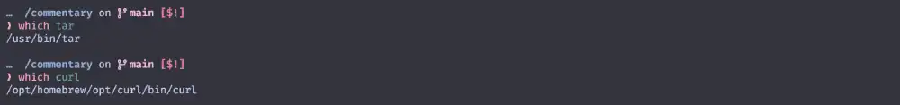

# nvim-treesitter

今回は `nvim-treesitter`を使ってみましょう😆

これさえ使いこなせれば、様々な言語のプログラムコードだったり、
時には`markdown`の編集など、様々な場面で役立ってくれるはずです❗

```admonish info title="[nvim-treesitter](https://github.com/nvim-treesitter/nvim-treesitter/tree/main)"
The `nvim-treesitter` plugin provides

`nvim-treesitter`プラグインは以下を提供します。

1. functions for installing, updating, and removing [**tree-sitter parsers**](https://github.com/nvim-treesitter/nvim-treesitter/blob/main/SUPPORTED_LANGUAGES.md);
2. a collection of **queries** for enabling tree-sitter features built into Neovim for these languages;
3. a staging ground for [treesitter-based features](https://github.com/nvim-treesitter/nvim-treesitter/tree/main) considered for upstreaming to Neovim.

For details on these and how to help improving them, see [CONTRIBUTING.md](https://github.com/nvim-treesitter/nvim-treesitter/blob/main/CONTRIBUTING.md).

1. [**tree-sitter parsers**](https://github.com/nvim-treesitter/nvim-treesitter/blob/main/SUPPORTED_LANGUAGES.md) のインストール、更新、削除機能;
2. Neovim に組み込まれた tree-sitter 機能をこれらの言語で有効にするための **クエリ** 集。
3. Neovim へのアップストリームが検討されている [treesitter-based features](https://github.com/nvim-treesitter/nvim-treesitter/tree/main)のステージング・グラウンド。

これらの詳細と改良の支援方法については、[CONTRIBUTING.md](https://github.com/nvim-treesitter/nvim-treesitter/blob/main/CONTRIBUTING.md)を参照してください。
```

このページの初掲は **Dec 4, 2022** ですが、
巡り巡って **Mar 30, 2026** 時点の状況に合わせて内容を書き換えています。

ところどころ、スクリーンショットが古いままになってたりはしますが、気にしないでください❗

```admonish danger title=""
You say you want a revolution{{footnote:
Revolution (by [The Beatles](https://en.wikipedia.org/wiki/The_Beatles)):
1968年初頭の政治的抗議運動に影響された Lennon の歌詞は、
社会変革の必要性に共感する一方で、新左翼の一部のメンバーが主張する暴力的な戦術には疑問を表明していた。

これまで大体において、The Beatles は自分たちの音楽で政治的見解を公に表現することを避けていたが、
他のメンバーの反対にもかかわらず、彼はこの曲にこだわり、シングルに収録するよう主張していた。
(唯一あからさまに政治的な楽曲としては[Taxman](https://en.wikipedia.org/wiki/Taxman)があった。)

8月にリリースされたこの曲は、政治的左派から "自分たちの大義に対する裏切り" であり、
The Beatles がカウンターカルチャーの急進的な要素から外れていることの表れだと見なされた。

Lennon はこの時に新左翼から受けた批判に心を痛め、
後の 1971年のシングル[Power to the People](https://en.wikipedia.org/wiki/Power_to_the_People_(song))では
[Marx 主義](https://en.wikipedia.org/wiki/Marxism)革命の必要性を唱えたが、
1980年に受けた最後のインタビューでは、Revolution で表明した[平和主義](https://en.wikipedia.org/wiki/Pacifism)的な感情を再確認している。
}}

Well you know

We all wanna change the world

革命を望んでるって君は言う

わかるだろ

みんな世界を変えたいんだ
```

## Requirements

一個ずつ確認していきましょう。

```admonish info title="[Requirements](https://github.com/nvim-treesitter/nvim-treesitter#requirements)"
- Neovim 0.12.0 or later (nightly)
- `tar` and `curl` in your path
- [`tree-sitter-cli`](https://github.com/tree-sitter/tree-sitter/blob/master/crates/cli/README.md) (0.26.1 or later, installed via your package manager, **not npm**)
- a C compiler in your path (see <https://docs.rs/cc/latest/cc/#compile-time-requirements>)
```

```admonish abstract title="IMPORTANT"
The current **support policy** for Neovim is

* the _latest_ [nightly prerelease](https://github.com/neovim/neovim/releases/tag/nightly).
Other versions may work but are neither tested nor considered for fixes.
Once this plugin is [considered stable](https://github.com/nvim-treesitter/nvim-treesitter/issues/4767),
support will be added for the latest release.

_最新_の[nightly prerelease](https://github.com/neovim/neovim/releases/tag/nightly)。
他のバージョンでも動作する可能性はありますが、テストは行われておらず、修正の対象にもなりません。

このプラグインが[安定版](https://github.com/nvim-treesitter/nvim-treesitter/issues/4767)とみなされた時点で、
最新リリース版への対応が追加されます。
```

```admonish danger title=""
You tell me that it's evolution

Well you know

We all wanna change the world

君はそれを進化だって説くけど

わかってるだろ

みんな世界を変えたいんだ
```

### Neovim 0.12.0 or later (nightly)

まずは`Neovim 0.12.0` 以降が必須とされていることに注意が必要です。

```admonish warning title="CAUTION"
This is a full, incompatible, rewrite.
If you can't or don't want to update, check out the
[`master` branch](https://github.com/nvim-treesitter/nvim-treesitter/blob/master/README.md)
(which is locked but will remain available for backward compatibility).

これは互換性のない完全な書き換えです。
アップデートができない、またはしたくない場合は、master ブランチをチェックしてください
(ロックされていますが、後方互換性のために引き続き利用可能です)。
```

```admonish danger title=""
But when you talk about destruction

Don't you know that you can count me out?{{footnote:
11月にリリースされた[Revolution 1](https://en.wikipedia.org/wiki/Revolution_(Beatles_song)#%22Revolution_1%22)は、
破壊的な変化に対する Lennon の不安を表しており、"count me out?" というフレーズの代わりに "count me out? - in" と歌われている。
}}

だけどもし 破壊についての話になるなら

僕のことは数に入れないでくれないか？
```

<video preload="none" width="1280" height="720" data-poster="img/godzilla-thumbnail.webp">
  <source src="img/godzilla.webm" type="video/webm">
  Your browser does not support the video/webm.
</video>

```admonish danger title=""
Don't you know it's gonna be

Alright, alright, alright{{footnote:
繰り返される "it's gonna be alright" というフレーズは、Lennon がインドで体験した超越瞑想から直接来たもので、
政治的に何が起ころうと、神が人類の面倒を見るという考えを伝えている。
}}

鈍調な日、混沌な日

オーライ、オーライ！ …オーライ？
```

### tar,curl

自分の環境で`tar`,`curl`を使用できるかを確認するには`which`コマンドを使ってみると良いです 😉

```sh
which tar
```

```sh
which curl
```

なんかそれっぽいパスが表示されていれば、きっと OK でしょう😆

私の環境で言えば、`tar` は最初から入っていたし、
`curl` は `brew install` で簡単にインストールできました。



```admonish danger title=""
You say you got a real solution

Well you know

We'd all love to see the plan{{footnote:
Lennon の反戦感情にも関わらずまだ反体制にはなっておらず、
Revolution では体制打倒を主張する人々の "計画を見たい" と表現している。
}}

真の解決策を得たって君は言う

わかるだろ

みんなそのプランを見てみたい
```

### tree-sitter CLI (0.25.0 or later)

これも`which`コマンドで確認できます。

```sh
which tree-sitter
```

`Homebrew`でインストールしている場合は `Required`として、一緒にインストールされているはずです。


```admonish danger title=""
You ask me for a contribution{{footnote:
カウンターカルチャーのリーダーとして見られていたThe Bealtes、特に John Lennon は
[Lenin 主義](https://en.wikipedia.org/wiki/Leninism),
[Stalin 主義](https://en.wikipedia.org/wiki/Stalinism),
[Trotsky 主義](https://en.wikipedia.org/wiki/Trotskyism),
[毛 主義](https://en.wikipedia.org/wiki/Maoism)のグループから、革命的大義を積極的に支持するよう圧力を受けており、
インドの ऋषिकेश で超越瞑想を学んでいる間に、最近の社会的動乱の波について曲を書くことを決めた。
}}

Well you know

We're all doin' what we can

僕に貢献を求めてくるけど

わかってるだろ

みんなできることをやっている
```

### C compiler

わたしの経験で言えば`macOS`では問題になったことがありません。最低限`Command Line Tools`が入っていれば大丈夫なはずです。
(例えば`Homebrew`のインストール時に自動で導入されます。)

`Windows`の場合はやっぱり[別途案内](https://github.com/nvim-treesitter/nvim-treesitter/wiki/Windows-support)
がされているので、そちらを参照頂ければ...。

`Linux`の場合、もしかしたら別途インストールが必要かもしれないので手っ取り早く解決方法だけ載っけちゃうんですが、
`gcc-c++`、もしくは`clang`をインストールするのが良さそうです。

|||
|:---:|:---:|
|**gcc-c++**||
|**clang**||

```admonish note
Readmeにも明記されているように`libstdc++`も必要になるはずなので、`gcc`だとうまくいきませんでした😮
```

```admonish danger title=""
But if you want money for people with minds that hate

All I can tell you is brother you have to wait

だけどもし 憎しみに染まった者たちのためにカネが欲しいって話になるなら

僕が言えるのは 「なあ兄弟、君は待たなきゃいけない」 ってことだ
```

### Node (23.0.0 or later) for some parsers

書いてあることそのままですが、"一部の" パーサーでは `Node v23` 以降を必要とします。

2025/06/05 時点では `LTS`バージョンが `v22` らしいので、
場合に依っては なんか妙にハードルが高く感じられるかもしれません。

例えば[Node.js®をダウンロードする](https://nodejs.org/ja/download/)
に最初に示されている通りに進んでしまうとうまく行かない (かもしれない) ...😰

`current`バージョンは `v24` まで進んでいるので、単純に「`brew`や`apt` を使った方が簡単だぞ❗」というのは簡単なんだけど...、
はっきり言って、私はここで責任を負わされたくありません 😤

「**もし必要になったら** 乗り越えて❗」ぐらいで見逃してください...🥹

```admonish note
よくわかんねー ってなっちゃう場合、ここはスキップして進みましょう 🐈
```

```admonish danger title=""
Don't you know it's gonna be

Alright, alright, alright

鈍調な日、こんな日

オーライ、オーライ！ …オーライ？{{footnote:
"なんか今の情勢よくわかんねー😑" ってなっちゃってるってことだ。
}}
```

## Install

前項の確認さえ済めば、あとは`packer`にお願いするだけで「あっ❗」と言う間に終わります😆

`extensions/init.lua`に以下を追記しましょう。

~~~admonish example title="extensions/init.lua"
```lua
require('packer').startup { function()
  use 'wbthomason/packer.nvim'

  -- 前節で入れたpackerと同列に並べる
  use {
    'nvim-treesitter/nvim-treesitter',
    run = ':TSUpdate',
  }

end,

-- (以下略)

```
~~~

そしたら `:PackerSync` を実行しましょう❗


簡単ですね😉 **すっごい古いスクリーンショットだから** 見にくいけど❗

```admonish note
オフィシャルに示されているのは[lazy.nvim](https://github.com/folke/lazy.nvim)を使用した設定方法なのですが、
このサイトでは[17章](../../outro/lazy.html)までは`packer`を使用したサンプルコードを示しています。

(これも書き直した方がいいとは思ってるんだけど...😅)
```

## Config

`Neovim`プラグインの場合、`Readme`である程度デフォルト設定が示されていて、
それを基に「変える？変えない？」を決めるみたいな、
割とアバウトな方法にどうしてもなってくる...んじゃないかなぁと思ってるんですがどうでしょう❓

今回はもうデフォルト設定のままでいくので、何もする必要がありません❗

```txt
setup({opts})                                          *nvim-treesitter.setup()*

    Configure installation options. Needs to be specified before any
    installation operation.

    インストールオプションの設定。
    インストール操作の前に指定する必要があります。

    Note: You only need to call `setup` if you want to set non-default
    options!

    注意: `setup` を呼び出す必要があるのは、デフォルト以外のオプションを設定する場合だけです！

    Parameters: ~
    • {opts}  `(table?)` Optional parameters:
              • {install_dir} (`string?`, default `stdpath('data')/site/`)
                directory to install parsers and queries to. Note: will be
                prepended to |runtimepath|.
```

```admonish note
以下の例は`Neovim`がまだパーサーを持っていなかった頃のスクリーンショットですが、
"適したパーサーを使用すると、こんな感じで色付けがされます" という例です。

|||
|:---:|:---:|
|**default**||
|**nvim-treesitter**||
```

```admonish danger title=""
You say you'll change the constitution

Well you know

We all wanna change your head

憲法を変えてやるって君は言う

まあ その通りだ

みんな "君のアタマ" を替えてやりたい
```

## Commands

まず前提として、以下があります。

~~~admonish info title=":h treesitter-parsers"
```txt
PARSER FILES                                              *treesitter-parsers*

Parsers are the heart of treesitter. They are libraries that treesitter will
search for in the `parser` runtime directory.

Nvim includes these parsers:

パーサはtreesitterの心臓部です。これらは treesitter が `parser` ランタイムディレクトリで検索するライブラリです。
Nvimはこれらのパーサーを含んでいます：

- C
- Lua
- Markdown
- Vimscript
- Vimdoc
- Treesitter query files |ft-query-plugin|

You can install more parsers manually, or with a plugin like
https://github.com/nvim-treesitter/nvim-treesitter .

手動でさらにパーサーをインストールすることもでき、
https://github.com/nvim-treesitter/nvim-treesitter のようなプラグインを使うこともできます。
```
~~~

ということで、`nvim-treesitter`を使用してパーサーを管理するために使うコマンドが以下に示されています😉

~~~admonish info title=":h nvim-treesitter-commands"
```txt
COMMANDS                                              *nvim-treesitter-commands*
```
~~~

次項から、さらっとした使い方だけ示します。

```admonish danger title=""
You tell me it's the institution

Well you know

You better free your mind instead

君はそれを制度だって説く

けど そうじゃない

君は心を解放したほうがいい
```

### TSInstall

~~~admonish info title=":h TSInstall"
```txt
:TSInstall {language}                                               *:TSInstall*

Install one or more treesitter parsers. {language} can be one or multiple
parsers or tiers (`stable`, `unstable`, or `all` (not recommended)). This is a
no-op of the parser(s) are already installed. Installation is performed
asynchronously. Use *:TSInstall!* to force installation even if a parser is
already installed.

1つ以上の treeitter パーサーをインストールします。
{language} には1つまたは複数のパーサーまたは階層 (`stable`、`unstable`、`all`(推奨しない)) を指定できます。
パーサがすでにインストールされている場合は、このオプションは無効です。
インストールは非同期に実行されます。
パーサーが既にインストールされている場合でも、強制的にインストールするには *:TSInstall!* を使用します。
```
~~~

`language` の部分は
[Supported languages](https://github.com/nvim-treesitter/nvim-treesitter/blob/main/SUPPORTED_LANGUAGES.md)
に示されているものから選んで指定します。

```admonish abstruct title="[Supported languages](https://github.com/nvim-treesitter/nvim-treesitter/blob/main/SUPPORTED_LANGUAGES.md)"
The following is a list of languages for which a parser can be installed through `:TSInstall`.

以下は、`:TSInstall`でパーサをインストールできる言語のリストです。

...
```

例えば `rust`パーサーをインストールしたいなー😆 ってなったら以下のコマンドを使用します。

```vim
:TSInstall rust
```

### TSInstallFromGrammar

~~~admonish info title=":h TSInstallFromGrammar"
```txt
:TSInstallFromGrammar {language}                         *:TSInstallFromGrammar*

Like |:TSInstall| but also regenerates the `parser.c` from the original
grammar. Useful for languages where the provided `parser.c` is outdated (e.g.,
uses a no longer supported ABI).

|:TSInstall| と似ていますが、`parser.c` を元の文法から再生成します。
提供された `parser.c` が古くなっている言語 (例えば、サポートされなくなった ABI を使用している場合など) に便利です。
```
~~~

あまり使う機会はないと思いますが、使い方は同じですね。

```vim
:TSInstallFromGrammar rust
```

### TSUpdate

~~~admonish info title=":h TSUpdate"
```txt
:TSUpdate [{language}]                                              *:TSUpdate*

Update parsers to the `revision` specified in the manifest if this is newer
than the installed version. If {language} is specified, update the
corresponding parser or tier; otherwise update all installed parsers. This is
a no-op if all (specified) parsers are up to date.

Note: It is recommended to add this command as a build step in your plugin
manager.

マニフェストで指定された `revision` がインストールされているバージョンより新しい場合、パーサを更新します。
{language} が指定されている場合は、対応するパーサまたは階層を更新します。
そうでない場合は、インストールされているすべてのパーサを更新します。
指定された全てのパーサが最新である場合、これは省略されます。

Note: このコマンドをプラグインマネージャのビルドステップとして追加することを推奨します。
```
~~~

インストールされているパーサをアップデートしたいならこれ❗

```vim
:TSUpdate
```

### TSUninstall

~~~admonish info title=":h TSUninstall"
```txt
:TSUninstall {language}                                           *:TSUninstall*

Deletes the parser for one or more {language}, or all parsers with `all`.

1つ以上の {language} のパーサを削除するか、`all` で全てのパーサを削除します。
```
~~~

インストールされているパーサを削除したいならこれ❗

```vim
:TSUninstall rust
```

### TSLog

~~~admonish info title=":h TSLog"
```txt
:TSLog                                                                  *:TSLog*

Shows all messages from previous install, update, or uninstall operations.

以前のインストール、アップデート、アンインストール操作のすべてのメッセージを表示します。
```
~~~

`nvim-treesitter`で行った操作のログを確認したいならこれ❗

```vim
:TSLog
```

## CheckHealth

これは`nvim-treesitter`に限らない`Neovim`の機能になりますが、`health`チェックというものがあります😉

~~~admonish info title=":h health"
```txt
health.vim is a minimal framework to help users troubleshoot configuration and
any other environment conditions that a plugin might care about.

health.vim は、プラグイン設定やその他の環境条件の
トラブルシューティングを支援するための最小限のフレームワークです。

Plugin authors are encouraged to write new healthchecks. |health-dev|

プラグインの作者は新しいヘルスチェックを書くことが推奨されています。
```
~~~

コマンドは`:h health-commands`にある通りです。試しに動かしてみましょう。

```vim
:che
```
 または

```vim
:checkhealth
```


結果が表示されましたね☺️ これは **すっごい古いスクリーンショット** だけど❗

診断内容はプラグインに依りますが、
`nvim-treesitter`の場合は、依存ソフトウェアの確認と、OS情報・インストールされたパーサの表示を行ってくれます。

~~~admonish note
これもヘルプそのままですが、指定したプラグインだけを診断することも可能です。

```vim
:che nvim-treesitter
```

とすると、`nvim-treesitter`のヘルスチェックのみを行えます。
~~~

```admonish tip
冒頭の説明では`環境条件`と表されていますが、`packer`の節で少し触れた`依存関係`と (大体は) 同じ意味でしょう。
プラグインによっては、今回のようにヘルスチェックを提供してくれているので、困った時はこれも参考にすると良いです😉
```

```admonish danger title=""
But if you go carryin' pictures of Chairman Mao

You ain't gonna make it with anyone anyhow{{footnote:
[毛泽东](https://zh.wikipedia.org/wiki/毛泽东)に言及したセリフ、
"But if you go carryin' pictures of Chairman Mao / You ain't gonna make it with anyone anyhow" はスタジオセッションで追加された。
その年の暮れにプロモーション・クリップを撮影していたとき、
Lennon は監督の [Michael Lindsay-Hogg](https://en.wikipedia.org/wiki/Michael_Lindsay-Hogg) に、
この曲の中で最も重要な歌詞だと語っているが、1972年までに Lennon は "あんなことを言うべきじゃなかった。" と考えを改めている。
[Wikipedia](https://en.wikipedia.org/wiki/Revolution_(Beatles_song))より
}}

肌身離さず 毛主席 の写真を持っていたって

どうせ誰とも上手くいかないんだから
```

## Revolution / Miracle Gift Parade 💝

というわけで `nvim-treesitter `でした。

さて、ここまで来たら次にやることはもう決まってますね😉 カラーテーマです❗

<video preload="none" width="1280" height="720" data-poster="img/miracle-gift-parade-part1.webp">
  <source src="img/miracle-gift-parade-part1.webm" type="video/webm">
  Your browser does not support the video/webm.
</video>

```admonish success
次回でついに瞳に優しく、そう❗生まれ変わるのです😆
```

```admonish danger title=""
Don't you know it's gonna be

Alright, alright, alright

鈍調な日、越えた日

オーライ、オーライ！ …オーライ？
```

```admonish danger title=""
Alright...
```

```admonish danger title=""
Alright...
```

```admonish danger title=""
Alright...
```

```admonish danger title=""
Alright...
```

```admonish danger title=""
Alright...
```

```admonish danger title=""
Alright...
```

```admonish danger title=""
Alright...
```

```admonish danger title=""
<div style="text-align: center; font-size: 600%">
OH! LIE!!
</div>


```
