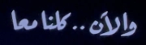
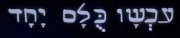

# Linter

```admonish info title=""
パパは昔 Beatles だったの？{{footnote:
Lennon は、幼なじみの家で偶然 TV で流れていた The Beatles のアニメ映画 "Yellow Submarine" を観てきた息子 Sean に
「パパは昔 Beatles だったの？」と聞かれた。
}}
```

大変だ〜❗2024年が始まっているうぅぅ😭

それはもうなんだか、本当に色々ありました...。

しかしわたしも、ようやくバイオリズムってものを取り戻して💃 徐々に POWER が漲ってきました ⭐🕺

```admonish success title=""
One, two, three, four

Can I have a little more?

Five, six, seven, eight, nine, ten

I love you
```

船を出そう❗機運を起こせ❗❗

```admonish success title=""
A, B, C, D

Can I bring my friend to tea?
```

世界では紅茶に塩を入れたりですとか、緑茶に柚子や砂糖を入れたりですとか、
わーわーゆうとりますけども、わたしは "It's all right", "괜찮아" です🫖

ただ、"はちみつカモミール" のティーバッグを淹れてるわたくしなんかが首を突っ込んでも火傷するだけですので🤐

っていうか、柚子砂糖緑茶もティーバッグで売り出してほしいなー 🍵

...。🙂

いや、tea の話❗

```admonish note
すでにお気づきかとは思いますが、このサイトはクセがつよいんですわぁ❗🤣
```

## Install

次の項からは`luacheck`と`biome`に触れていきます。

追加のインストールが手間だったり、そもそもその言語使ってないってことも当然あると思うので、
これらを実際にインストールするかどうかはおまかせします😺

```admonish success title=""
E, F, G, H, I, J

I love you
```

### luacheck

いつも通り`lua`の`linter`である`luacheck`を試しながら進めようと思ったんですが...。


実はわたし自身、今までこれを使ってこなかったので「えぇ...😨」ってなりました。

`luarocks`自体は`brew`とか`apt`とかでインストールできるので、
これを行った上で再度`mason`から`luacheck`をインストールすれば進めるはずです。


対応している言語はもちろん`Lua`です☺️


`vim`は知らないのに`nvim_buf_get_option`が`Deprecated`なのは知ってる、とってもクセつよさんでした❗

...っていうか、`nvim_buf_get_option`を自分が使っていることを忘れていたので「えぇ...😨」 ってなりました。

```admonish note
ほんとはちゃんと`nvim_buf_get_option`に触れなきゃいけないと思うんですが、
まずはこのページを書き上げてしまいたいので、`Issues`に挙げとくってことで見逃してください...😅
```

### biome

次はわたしも普段お世話になってる`biome`です。

確認してないんだけど、こっちはインストールと動作に`npm`が必要なんじゃないかな❓

現時点では`JSON`,`JavaScript`,`TypeScript`に対応しています。

```admonish info
将来的には`CSS`,`HTML`,`Markdown`にも対応するんだって😆

[Expand Biome’s language support](https://biomejs.dev/blog/roadmap-2024/#expand-biomes-language-support)
```


実際はこれでもちゃんと動くコードなんだけど、`Error`として報告してきます。

...。🙄

いや、とってもクセ❗❗

このサイトでもなんにも考えず気軽に使い始めてたんですが、
最初はなんか未曾有のバイオハザード🧟‍♂️だったので「えぇ...😨」 ってなりました。

## Configuration file

一応ちょっとだけ補足しておくと、
`luacheck`には`luacheckrc`、`biome`には`biome.json`みたいな、`Linter`のルールやマナーを調整する方法が用意されています。

たぶん他の`Linter`でもそうなってるんじゃないかな❓

ただ、これは`Neovim`とはまた別のおはなしなので、このサイトでは扱いません🤐

(...っていうか、わたしもそこまで詳しく知らない😅)

```admonish success title=""
Black, white, green, red

Can I take my friend to bed?

Pink, brown, yellow, orange and blue

I love you!
```

## All Together Now

ということで、`Linter`のおはなしでした😆

ここでは`lua`と`javascript`に限ってしまいましたが、
どの`Linter`を使う場合でも「似たようなもんだろー」と思ってもらえばだいじょうぶ❗

...たぶん😮

「えぇ...😨」ってなりました❓

そんな不安の退治法はひとつ。

Singing❗

```admonish info title=""
One!
```

```admonish info title=""
Two!
```

```admonish info title=""
Three!
```

```admonish info title=""
Four!!
```

```admonish success title=""
(Bom bom bom bompa bom!)

Sail the ship!
```

```admonish success title=""
(Bompa bom!)

Chop the tree!
```

```admonish success title=""
(Bompa bom!)

Skip the rope!
```

```admonish success title=""
(Bompa bom!)

Look at me!!
```

```admonish success title=""
All together now{{footnote: All Together Now (by [The Beatles](https://en.wikipedia.org/wiki/The_Beatles)):
McCartney は、観客に参加を求めるミュージック・ホールの伝統にインスパイアされたタイトル・フレーズを持つ、
子供向けの合唱曲だと説明している。
}}
!!
```

<div style="text-align: center; font-size: 110%; line-height: 0;">
<div style="margin-top: 4rem"></div>

All Together Now

<div style="margin-top: 4rem"></div>

TΩРА ОΛОI MAZI

<div style="margin-top: 4rem"></div>

Tutti insieme adesso

<div style="margin-top: 4rem"></div>

Nu allemaal samen

<div style="margin-top: 4rem"></div>



<div style="margin-top: 4rem"></div>

Todos juntos ahora

<div style="margin-top: 4rem"></div>


<div style="margin-top: 4rem"></div>

Kwa pamoja sasa

<div style="margin-top: 4rem"></div>


<div style="margin-top: 4rem"></div>

Tous en choeur maintenant

<div style="margin-top: 4rem"></div>



<div style="margin-top: 4rem"></div>

Allihopa tillammans nu

<div style="margin-top: 4rem"></div>

И ТЕПЕРЬ: ВСЕ ВМЕСТE

<div style="margin-top: 4rem"></div>

現在大家一齊唱

<div style="margin-top: 4rem"></div>

Und jetzt alle zusammen

<div style="margin-top: 4rem"></div>

それでは 皆さん 御一緒に

<div style="margin-top: 4rem"></div>
</div>

```admonish success
We are all together now!!{{footnote:
この曲のサブカレントについて、
"We are all together now" (僕たちは今 みんな一緒にいる) という二重の意味を持つと McCartney は述べている。

1968年に公開された映画 Yellow Submarine のラストでは、
この曲に合わせて各国語で "All Together Now" を意味する言葉が画面に現れる。

[Wikipedia](https://en.wikipedia.org/wiki/All_Together_Now_(Beatles_song))より
}}
```

```admonish warning title=""
じか〜い、じかい。

17.5.3話「えるえすぴーミーツミー」という おはなし。
```
