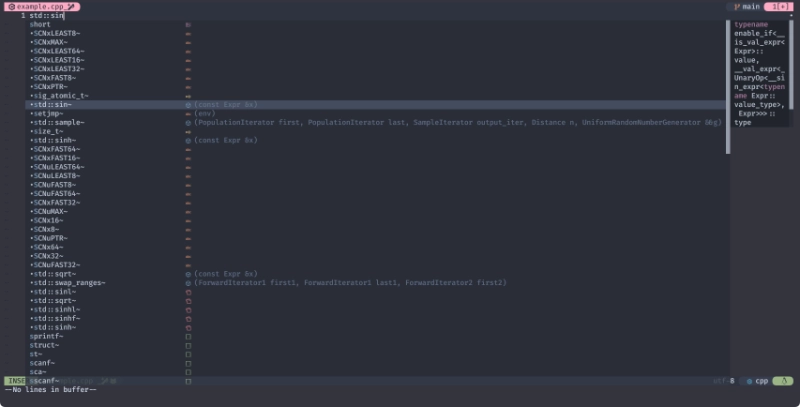
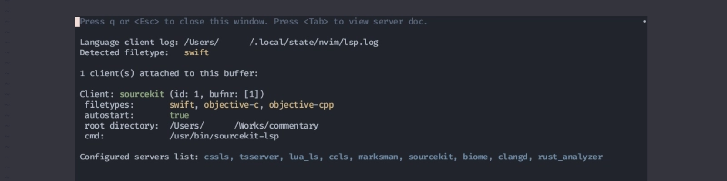

# 🍑 LSP (Meet Me)

このサイトを見たな❗これでお前とも縁ができた❗


個人でやってる趣味 (暇つぶしとも言う😅) にしては、なかなか身に余る光栄です。

```admonish danger title=""
やあ やあ やあ！

祭りだ 祭りだ！
```

舟を出せ❗いざ鬼退治❗❗

## ☕ Previously

ちょっとだけ むか〜し、むかしのおさらい。

~~~admonish example title="extensions/mason.lua"
```lua
require('mason').setup {
  ui = {
    check_outdated_packages_on_open = false,
    border = 'single',
  },
}

require('mason-lspconfig').setup_handlers {
  function(server_name)
    require('lspconfig')[server_name].setup {
      capabilities = require('cmp_nvim_lsp').default_capabilities(),
    }
  end,
}
```
~~~

固有の設定を必要としなければ、
これだけで`mason.nvim`でインストールした`LSP`は全てカバーできていましたね😆

~~~admonish tip
このサイトでは`packer`と外観の統一感を持たせる目的で`mason`に[border](../neovim/lsp/mason.html#border)を入れていました。

`lazy`を使う場合、これはもう無いほうが統一感が出ていいかも〜😪

```diff
require('mason').setup {
  ui = {
    check_outdated_packages_on_open = false,
-   border = 'single',
  },
}
```
~~~

```admonish danger title=""
袖振り合うも他生の縁！

躓く石も縁の端くれ！
```

## 🧠 Additional Setup

ここから一歩進めて、「固有の設定を入れてみよう」というのがこの節のおはなしです。

まず最初に、この先を簡潔に書くために、あらかじめこんなん仕込んでおきます🤫

~~~admonish example title="extensions/mason.lua"
```diff
+local lsp = require 'lspconfig'

 require('mason-lspconfig').setup_handlers {
   function(server_name)
     require('lspconfig')[server_name].setup {
       capabilities = require('cmp_nvim_lsp').default_capabilities(),
     }
   end,

   -- (ここに mason.nvim でインストールした lsp の固有設定を必要に応じて追加していきます)

 }
```
~~~

```admonish note title="脳人"
[nvim-lspconfig](../neovim/lsp/nvim-lspconfig.html)はもうお馴染みですね😉
```

```admonish danger title=""
共に踊れば繋がる縁！

この世は楽園！
```

## 🕶️ Specific Settings

ここでは`lua_ls`と`rust-analyzer`を例に進めていきます。

当然ながら、これらを実際にインストールするかどうかはおまかせします😆

```admonish danger title=""
悩みなんざ吹っ飛ばせ！

笑え 笑え！
```

### 🐵 lua_ls (Lua)

```admonish note title=""
探してた この心うっきうき暴れさせて
```

```admonish info title="[lua-language-server](https://github.com/LuaLS/lua-language-server)"
The Lua language server provides various language features for Lua to make development easier and faster.
With nearly a million installs in Visual Studio Code, it is the most popular extension for Lua language support.

Lua 言語サーバーは、Lua の様々な言語機能を提供し、開発をより簡単かつ高速にします。
Visual Studio Code に 100万近くインストールされており、Lua 言語をサポートする最も人気のある拡張機能です。

[See our website for more info](https://luals.github.io).
```

100万とか言わないでください。1Kが霞むんで🤣

わたしはだいぶ長〜い間気づきませんでしたが、
`nvim-lspconfig`の[lua_ls](https://github.com/neovim/nvim-lspconfig/blob/master/doc/server_configurations.md#lua_ls)を参考に
以下のコードを追加してみると...。

~~~admonish example title="extensions/mason.lua"
```lua
['lua_ls'] = function()
  lsp.lua_ls.setup {
    on_init = function(client)
      -- わたしの環境では workspace_folders が存在しないケースがあったので対処しています.
      if not client.workspace_folders then
        return
      end

      local path = client.workspace_folders[1].name

      if vim.uv.fs_stat(path .. '/.luarc.json') or vim.uv.fs_stat(path .. '/.luarc.jsonc') then
        return
      end

      client.config.settings.Lua = vim.tbl_deep_extend('force', client.config.settings.Lua, {
        runtime = {
          -- Tell the language server which version of Lua you're using
          -- (most likely LuaJIT in the case of Neovim)
          version = 'LuaJIT',
        },
        workspace = {
          checkThirdParty = false,
          library = {
            vim.env.VIMRUNTIME,
            -- Depending on the usage, you might want to add additional paths here.
            -- "${3rd}/luv/library"
            -- "${3rd}/busted/library",
          },
          -- or pull in all of 'runtimepath'. NOTE: this is a lot slower
          -- library = vim.api.nvim_get_runtime_file("", true)
        },
      })
    end,
    settings = {
      Lua = {},
    },
  }
end,
```
~~~

こうすると`Neovim`固有のAPIが`lua_ls`を通して補完候補に現れます😉


[fidget.nvim](../neovim/lsp/fidget.html#七--try)を使用しているのであれば、ここでもパワーが溜まってきただろう❗❗


`Neovim`を使う場合はこれを入れておくと楽しいです🤗

### 🐶 rust-analyzer (Rust)

```admonish example title=""
冒険はいつだってワンだふる
```

```admonish info title="[rust-analyzer](https://github.com/rust-lang/rust-analyzer)"
rust-analyzer is a modular compiler frontend for the Rust language.
It is a part of a larger rls-2.0 effort to create excellent IDE support for Rust.

rust-analyzer は、Rust 言語用のモジュラー・コンパイラ・フロントエンドです。
Rust の優れた IDE サポートを作成するための、より大きな rls-2.0 の取り組みの一部です。
```

と、いうことで`Rust`にはこれがいいんじゃないかと思うんだけど、
どこを見て持ってきたのかが思い出せなくて見つからない...😑

~~~admonish example title="extensions/mason.lua"
```lua
['rust_analyzer'] = function()
  lsp.rust_analyzer.setup {
    settings = {
      ['rust-analyzer'] = {
        diagnostic = { enable = false },
        assist = { importGranularity = 'module', importPrefix = 'self' },
        cargo = { allFeatures = true, loadOutDirsFromCheck = true },
        procMacro = { enable = true },
      },
    },
  }
end,
```
~~~

#### 🐦 Clippy

```admonish quote title=""
繋がってく縁と縁 出会いは少しトリッキー
```

```admonish info title="[Clippy](https://github.com/rust-lang/rust-clippy)"
A collection of lints to catch common mistakes and improve your [Rust](https://github.com/rust-lang/rust) code.

[There are over 700 lints included in this crate!](https://rust-lang.github.io/rust-clippy/master/index.html)

Lints are divided into categories, each with a default [lint level](https://doc.rust-lang.org/rustc/lints/levels.html).
You can choose how much Clippy is supposed to ~~annoy~~ help you by changing the lint level by category

よくあるミスを発見し、あなたの[Rust](https://github.com/rust-lang/rust)コードを改善するための lint のコレクションです。

[この crate には 700以上のリントが含まれています！](https://rust-lang.github.io/rust-clippy/master/index.html)

Lints はカテゴリに分かれており、
それぞれデフォルトの[lint level](https://doc.rust-lang.org/rustc/lints/levels.html) を持っています。
カテゴリごとに lint level を変更することで、Clippy がどの程度あなたを ~~迷惑~~ 手助けするかを選択できます。
```

これはちょっと確認してないんですが、
`Clippy`は`mason.nvim`からは入らないんじゃないかな❓

`Rust`の環境を入れると、たぶん自然にインストールされてるやつです。

~~~admonish example title="extensions/mason.lua"
```diff
  ['rust_analyzer'] = function()
    lsp.rust_analyzer.setup {
      settings = {
        ['rust-analyzer'] = {
          diagnostic = { enable = false },
          assist = { importGranularity = 'module', importPrefix = 'self' },
          cargo = { allFeatures = true, loadOutDirsFromCheck = true },
          procMacro = { enable = true },
+         checkOnSave = { allFeatures = true, command = 'clippy' },
        },
      },
    }
  end,
```
~~~


こんな感じで、`rustc`に混じって`clippy`も怒るようになります😱

## 👹 If mason is not available

```admonish warning title=""
打ち解けりゃ鬼も笑う
```

普段使っている言語によっては、`mason.nvim`にない`LSP`を使用したいこともあると思うんですが、
`nvim-lspconfig`を使用しているのであれば、まあ大抵はなんとかなります😗

```admonish info title="[Configurations](https://github.com/neovim/nvim-lspconfig/blob/master/doc/server_configurations.md)"
LSP configs provided by nvim-lspconfig are listed below.
This documentation is autogenerated from the Lua files.
You can view this file in Nvim by running `:help lspconfig-all`.

nvim-lspconfigが提供するLSPコンフィグを以下に示します。
このドキュメントは Lua ファイルから自動生成されます。
Nvim で`:help lspconfig-all`を実行するとこのファイルを見ることができます。
```

わたしの場合、
これは[nvim-lspconfig.lua](../neovim/lsp/nvim-lspconfig.html#admonition-extensionsnvim-lspconfiglua)の末尾に置いてます。

~~~admonish example title="extensions/nvim-lspconfig.lua"
```diff
 vim.api.nvim_create_autocmd('LspAttach', {

   ...

 })

+local lsp = require 'lspconfig'

 (ここから先に固有の設定を追加していきます)

```
~~~

...で、例えば私が使っている (入っているだけとも言う😅) `lsp`は以下です。

### 🐲 SourceKit-LSP (Swift)

```admonish question title=""
見える景色がちょっとずつ違う
```

```admonish info title="[SourceKit-LSP](https://github.com/apple/sourcekit-lsp)"
SourceKit-LSP is an implementation of the [Language Server Protocol](https://microsoft.github.io/language-server-protocol/) (LSP)
for Swift and C-based languages. It provides features like code-completion and jump-to-definition to editors that support LSP.
SourceKit-LSP is built on top of [sourcekitd](https://github.com/apple/swift/tree/main/tools/SourceKit)
and [clangd](https://clang.llvm.org/extra/clangd.html) for high-fidelity language support,
and provides a powerful source code index as well as cross-language support.
SourceKit-LSP supports projects that use the Swift Package Manager.

SourceKit-LSP は、Swift と C ベースの言語のための [Language Server Protocol](https://microsoft.github.io/language-server-protocol/)(LSP) の実装です。
LSP をサポートするエディタにコード補完や定義へのジャンプなどの機能を提供します。
SourceKit-LSP は、[sourcekitd](https://github.com/apple/swift/tree/main/tools/SourceKit)と[clangd](https://clang.llvm.org/extra/clangd.html)の上に構築され、忠実度の高い言語サポートを実現し、
強力なソースコードインデックスとクロスランゲージのサポートを提供します。
SourceKit-LSP は Swift Package Manager を使用するプロジェクトをサポートします。
```

`macOS`で`Xcode`をインストールしている環境であれば、これも自然に入ってます。

~~~admonish example title="extensions/nvim-lspconfig.lua"
```lua
lsp.sourcekit.setup {
  filetypes = { 'swift', 'objective-c', 'objective-cpp' },
}
```
~~~


普段使ってないからなんか妙に余裕ないけど許して (その一) 😅

### 🐯 ccls (C/C++)

```admonish warning title=""
みなさまのお手を拝借
```

```admonish info title="[ccls](https://github.com/MaskRay/ccls)"
ccls, which originates from [cquery](https://github.com/jacobdufault/cquery), is a C/C++/Objective-C language server.

ccls は[cquery](https://github.com/jacobdufault/cquery)に由来する、C/C++/Objective-C 言語サーバーです。
```

これは`brew`とか`apt`とか使えばお手軽ですね😉

~~~admonish example title="extensions/nvim-lspconfig.lua"
```lua
lsp.ccls.setup {
  init_options = {
    compilationDatabaseDirectory = 'build',
    index = {
      threads = 0,
    },
    clang = {
      extraArgs = { '--std=c++20' },
      excludeArgs = { '-frounding-math' },
    },
  },
}
```
~~~



普段使ってないからなんか妙に余裕ないけど許して (その二) 😅

## 🦈 Root Directory

ちなみになんですが...。

毎度のことながら、なんかじょーずにいかないなーと思ったら`LspInfo`を確認してみましょう。


...もし`root directory`が`Not found.`(認識されていない状態) だと、
それは "履 い て な い" らしいんです、PAAAANTS!! 🤷‍♀️



普段使ってないからなんか妙に余裕ないけど許して (その三) 😅

## 🍑 Don't Boo! ドンブラザーズ

さて "立春 🌸" の前に "節分 🫘" です。色々仕切り直していきましょう❗

豆をまいて...、年の数だけ数えながら豆を食べて...。

そのあとはノーカウントで食べ放題だ😆

どこの家でもそうだろう❓😏

...違うの⁉️

```admonish success
So, let's get the party started!
```

```admonish danger title=""
じか〜い、じかい。
```

```admonish danger title=""
なに？ 王様戦xxxxングオージャーが最終回？？

だったら俺たちも最終回だ。MVP を決めてやる。
```

<div style="margin-top: 4rem"></div>
<div style="text-align: center; font-size: 400%; line-height: 0;">
🐵 🍑 🐦

🐶 🐲 👹
</div>

**さようなら、ドンブラザーズ{{footnote:
『暴太郎戦隊ドンブラザーズ』（あばたろうせんたいドンブラザーズ）は、2022年3月6日から2023年2月26日まで
テレビ朝日系列で放送された東映制作の特撮テレビドラマ、および作中で主人公たちが変身するヒーローの名称。
モチーフは日本を代表するおとぎ話の一つ・『桃太郎』であり、
同作品に登場する人物・動物をモデルにした桃井タロウと 4人の個性豊かなオトモたちが、
人々を守るため、そして自分の願いを叶えるために脳人やヒトツ鬼と戦う。
「暴太郎」という名称は、「アバター戦隊」か「桃太郎戦隊」かで悩んでいた企画陣に対し、
ある人物が両方をまとめて「暴太郎」にすればいいと意見を出して採用された。
[Wikipedia](https://ja.wikipedia.org/wiki/暴太郎戦隊ドンブラザーズ)より
}}
❗**

```admonish danger title=""
MVP とは、俺のことだ！！

17.7話 「フィナーレいさみあし
{{footnote: 実際は`nvim_get_option_value`の おはなしで、このサイトの最終回まではあと 3回...か、4回❗}}
」という おはなし。
```
