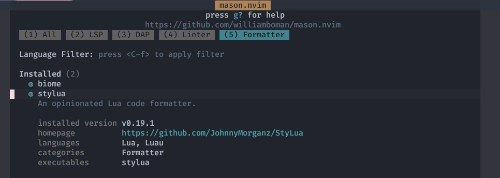
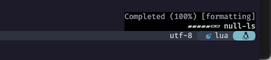
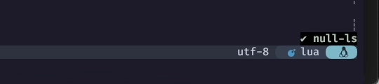

# mason-null-ls

```admonish quote title=""
私はたぶん、Mimi おばさんの役割を引き継いだんだと思う。
```

```admonish success title=""
So this is Christmas

And what have you done?

さあ クリスマスがやってきた

君にはどんな1年だった？
```

もう色々見透かされているとは思ってますが、
そんなものは気にせず、ど真ん中をぶっちぎります❗

`mason-null-ls`のお通りだー❗

```admonish info title="[mason-null-ls](https://github.com/jay-babu/mason-null-ls.nvim)"
mason-null-ls bridges mason.nvim with the null-ls plugin - making it easier to use both plugins together.

`mason-null-ls`は`mason.nvim`と`null-ls`プラグインの橋渡しをします。
```

`mason.nvim`も`null-ls` `(none-ls)`も、とっても見覚えあるやつですね😉

```admonish warning
このサイトの方針上、引用はそのまま載っ (以下略 ❗)
```

```admonish success title=""
Another year over

And a new one just begun

今年ももう終わる

そして新しい年が始まるんだ
```

## Introduction

```admonish info title="[Introduction](https://github.com/jay-babu/mason-null-ls.nvim#introduction)"
`mason-null-ls.nvim` closes some gaps that exist between `mason.nvim` and
`null-ls`. Its main responsibilities are:

`mason-null-ls.nvim`は`mason.nvim`と`null-ls`の間に存在するいくつかのギャップを埋める。
主な役割は以下の通り：

- provide extra convenience APIs such as the `:NullLsInstall` command
- allow you to (i) automatically install, and (ii) automatically set up a predefined list of sources
- translate between `null-ls` source names and `mason.nvim` package names (e.g. `haml_lint` <-> `haml-lint`)

It is recommended to use this extension if you use `mason.nvim` and `null-ls`.
Please read the whole README.md before jumping to [Setup](https://github.com/jay-babu/mason-null-ls.nvim#setup).

**Note**: this plugin uses the `null-ls` source names in the APIs it exposes - not `mason.nvim` package names.

- `NullLsInstall`コマンドのような便利な API を提供する。
- (i) 自動インストール、(ii) あらかじめ定義されたソースリストの自動セットアップ。
- `null-ls`ソース名と`mason.nvim`パッケージ名の変換 (例:`haml_lint`<->`haml-lint`)

`mason.nvim`と`null-ls`を使う場合はこの拡張機能を使うことを推奨します。
[Setup](https://github.com/jay-babu/mason-null-ls.nvim#setup) に入る前に README.md 全体を読んでください。

**Note**: このプラグインが公開する API では、`mason.nvim`のパッケージ名ではなく`null-ls`のソース名を使用します。
```

```admonish success title=""
And so this is Christmas

I hope you had fun

そう クリスマスがやってきたんだ

楽しんでいるかな
```

## Requirements

```admonish info title="[Requirements](https://github.com/jay-babu/mason-null-ls.nvim#requirements)"
- neovim >= 0.7.0
- [mason.nvim](https://github.com/williamboman/mason.nvim)
- [null-ls.nvim](https://github.com/jose-elias-alvarez/null-ls.nvim)
```

これもやっぱり特に難しい要求はありませんが、
このサイトでは [none-ls](https://github.com/nvimtools/none-ls.nvim) を使用していきます。

...ややこしいんですけども。

```admonish success title=""
The near and the dear ones

The old and the young

近くて 大切な人たち

お年寄りも 若者も
```

## Installation

~~~admonish info title="[Installation](https://github.com/jay-babu/mason-null-ls.nvim)"
[lazy.nvim](https://github.com/folke/lazy.nvim)

```lua
{
    "jay-babu/mason-null-ls.nvim",
    event = { "BufReadPre", "BufNewFile" },
    dependencies = {
      "williamboman/mason.nvim",
      "jose-elias-alvarez/null-ls.nvim",
    },
    config = function()
      require("your.null-ls.config") -- require your null-ls config here (example below)
    end,
}
```
~~~

`config`は次の項で行うとして、インストール部分を先に済ませてしまいましょう❗

~~~admonish example title="extensions/init.lua"
```lua
{
  'jay-babu/mason-null-ls.nvim',
  event = { 'BufReadPre', 'BufNewFile' },
  dependencies = {
    'williamboman/mason.nvim',
    'nvimtools/none-ls.nvim',
  },
},
```
~~~

`null-ls.nvim`を`none-ls`に変えるのを忘れないで😉

```admonish success title=""
A very merry Christmas

And a happy New Year
```

```admonish success title=""
Let's hope it's a good one

Without any fear

良い年でありますように

なにも心配ないよ
```

### Automatic Setup Usage

```admonish info title="[Automatic Setup Usage](https://github.com/jay-babu/mason-null-ls.nvim#automatic-setup-usage)"
Automatic Setup is a need feature that removes the need to configure `null-ls` for supported sources.
Sources found installed in `mason` will automatically be setup for null-ls.

自動セットアップは、サポートされているソースに対して `null-ls` を設定する必要性を取り除く機能です。
`mason` にインストールされたソースは自動的に null-ls 用にセットアップされます。
```

例えば、それはもうめちゃくちゃ言語プロフェッショナルが扱う場合は、
`handlers`に個別に書いた方がきっちりできるはずです。

...ただ、そうでもない場合、言語ごとに一個一個の設定をしていかなきゃならないってなると、
`mason.nvim`が提供してくれるお手軽さが、かなり損なわれてしまいます。

でも、それではあまりにも勿体ないので、
これを理解した上で使用する分にはいいんじゃないかな〜って思うことにします❗そうします😆

```admonish success title=""
And so happy Christmas (War is over)
{{footnote: Happy Xmas (War Is Over) (by [John & Yoko / Plastic Ono Band](https://en.wikipedia.org/wiki/Plastic_Ono_Band)
with the [Harlem](https://en.wikipedia.org/wiki/Harlem) Commjnity Choir)
}}
```

```admonish success title=""
For black and for white

For yellow and red ones

黒と白のために

黄色と赤だって
```

```admonish success title=""
Let's stop all the fight

すべての争いをやめよう
```

#### Example Config

~~~admonish info title="[Example Config](https://github.com/jay-babu/mason-null-ls.nvim#example-config)"
```lua
require("mason").setup()
require("mason-null-ls").setup({
    handlers = {},
})
```

See the [Default Configuration](https://github.com/jay-babu/mason-null-ls.nvim#default-configuration)
section to understand how the default configs can be overridden.

デフォルト設定を上書きする方法については、
[Default Configuration](https://github.com/jay-babu/mason-null-ls.nvim#default-configuration)セクションを参照してください。
~~~

このページでは`mason`の`setup()`はもう済んでいるものとして特に触れません。

その上で、ここも`lazy.nvim`をもっと頼って (怠けちゃって) いいと思います。

`opts`に変数のテーブルを指定すると`lazy.nvim`の`Plugin.config()`に渡してくれるので、
上で示されているコードは、シンプルにこんな感じで済ませてしまってもいいんじゃないかな😌

~~~admonish example title="extensions/init.lua"
```diff
{
  'jay-babu/mason-null-ls.nvim',
  event = { 'BufReadPre', 'BufNewFile' },
  dependencies = {
    'williamboman/mason.nvim',
    'nvimtools/none-ls.nvim',
  },
+ opts = {
+   handlers = {}
+ },
},
```
~~~

[Default Configuration](https://github.com/jay-babu/mason-null-ls.nvim#default-configuration)を見ての通り、
デフォルトでは`nil`になっているのでこれを`Array`でオーバーライドしています。

```admonish note
ぱっと見た感じ、`handlers`に対して「なんやこいつ😮」と思わなくもないんですが、これないと動かないでしょ❓
```

## Usage

ここまでやれば、あとは`Mason`からインストールするだけでおっけーです❗

試しに`stylua`でも入れてみましょ。



```admonish note
`Mason`からも確認できますが、`stylua`は`lua` `luau`の`Formatter`ですね。
```

それから`lua`を開いて、前回も出てきた [vim.lsp.buf.format](none-ls.html#vimlspbufformat) を呼んでみれば...、



ここにパワーが溜まってきただろう❗❗



そしてなんかいい感じにフォーマットされただろう⁉️

### ( If it does not work well... )

```admonish warning
パワーが上手く溜まってこない場合は`lua`ファイルを開いた状態で`:LspInfo`を確認してみてください。


...もし`Client`に`null-ls`が認識されていなければ、それは "履 い て な い" んです、PAAAANTS!! 🤷‍♀️

急いで`none-ls.nvim` まで戻って "履 い て" 来てください 👉🩲👈
```

## War is Over

私事ではありますが、ちょっと時間がなくて`Linter`には全く触れられませんでした...。

また落ち着いたら [このへん](../neovim/lsp/fidget.html#admonition-tip-1) も含めて改めてやりましょ❗

去年もおんなじようなこと言っちゃっててかわいいですね❗❗
下手しても失敗しても、未来で笑い飛ばせばいいんです❗❗
...はい、ごめんなさい🥹

ハッピークリスマス❗🍾 サンタさんも大喜びです🎅

愉しんできてね🤗

...あ❗もうおたのしみでしたか😸

```admonish success title=""
<div style="text-align: center" font-weight: bold">
<div style="font-size: 800%; line-height: 0;">

WAR

IS

OVER!
</div>
<div style="font-size: 150%; font-weight: bold" >
IF YOU WANT IT
</div>

<div style="margin-top:4em"></div>

<div style="font-size: 150%; font-weight: bold" >
Happy Christmas from John & Yoko
</div>
</div>
```

```admonish success title=""
War is over
{{footnote:
1969年の暮れ、John と Yoko は世界12都市の街頭にビルボードを使った大きな広告を掲げた。
}}

戦争は終わる
```

```admonish success title=""
If you want it

あなたがそう望むなら
```

```admonish success title=""
War is over
{{footnote:
1971年にレコーディングした Happy Christmas (War is Over) は、やがてクリスマス・ソングの定番となった。
コーラスの「War is Over. If you want it (戦争は終わる あなたがそう望むなら)」には、いまだにビルボード・キャンペーンの精神が脈打っている。
その一方で「さあ、クリスマスがやってきた。君にはどんな1年だった？」という普遍的な歌詞により、
この歌とそれが伝えるメッセージは、毎年のクリスマスシーズンのたびに人々へと届くようになった。
}}

戦争は終わった
```

```admonish success title=""
Now

たった今
```
