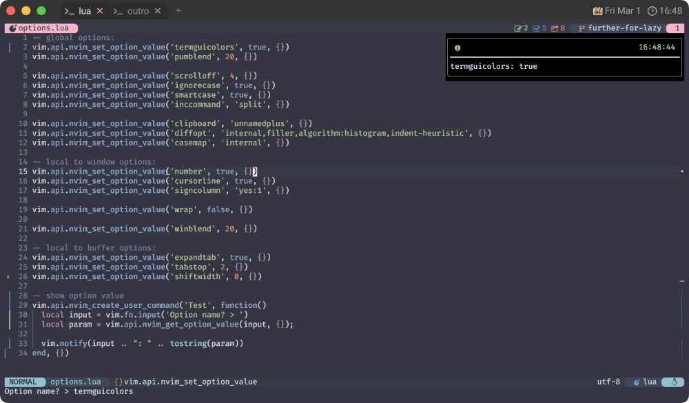
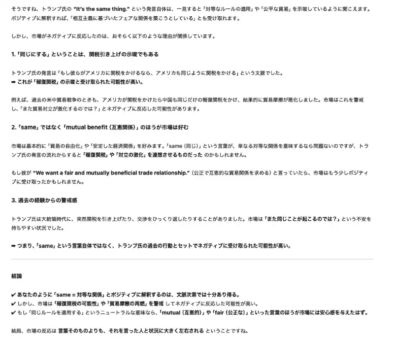

# 🦥 nvim_get_option_value

このサイトでは以前、`nvim_buf_get_option`を使用したコードを提示していたのですが、これは既に`deprecated`です。

なので必然的に`nvim_get_option_value`へお乗り換えです 🚅

...まあ、そうは言っても終盤に来て説明されるまでもない事ですので、すぐ終わっちゃいます😆

~~~admonish info title=":h nvim_get_option_value"
```txt
nvim_get_option_value({name}, {opts})                *nvim_get_option_value()*
  Gets the value of an option. The behavior of this function matches that of
  |:set|: the local value of an option is returned if it exists; otherwise,
  the global value is returned. Local values always correspond to the
  current buffer or window, unless "buf" or "win" is set in {opts}.

  option の値を取得する。
  この関数の動作は |:set| と同じです。
  オプションが存在する場合はローカル値が返され、存在しない場合はグローバル値が返されます。
  ローカル値は、{opts} で "buf" または "win" が設定されていない限り、常に現在のバッファまたはウィンドウに対応します。

  Parameters: ~
    • {name}  Option name
    • {opts}  Optional parameters
              • scope: One of "global" or "local". Analogous to |:setglobal|
                and |:setlocal|, respectively.
              • win: |window-ID|. Used for getting window local options.
              • buf: Buffer number. Used for getting buffer local options.
                Implies {scope} is "local".
              • filetype: |filetype|. Used to get the default option for a
                specific filetype. Cannot be used with any other option.
                Note: this will trigger |ftplugin| and all |FileType|
                autocommands for the corresponding filetype.

  Return: ~
    Option value
```
~~~

そういえば、先日(と言っても結構前なんだけど) 新宿に降りて、西口側に行ったんです。

あの辺ってなんか絶賛再開発中🏗️ でガチャガチャしてるんですよね〜。
それを横目に階段で地上に上がろうとしたんですが...。

封鎖されている...❗ほぼ全て😑

```admonish success title=""
How does it feel to be one of the beautiful people?

Now that you know who you are

崇高な人達の輪に加われた気分はどう?

君は自分が何者かを知ったんだ
```

```admonish success title=""
What do you want to be?

And have you traveled very far?

それでどうしたいの?

君は届かない所に旅したつもり？
```

ここでふと思うわけです。

まあ🤭 Prison 👮‍♀️🩷

```admonish success title=""
Far as the eye can see

せいぜい ここから目の届く範囲だろ
```

## ⚾ Try

簡単ではあるんですけど、やっぱ確信は欲しいので「試しに動かしてみよー。」って思うわけです。

なので、こんなコードを カ キ マ シ タ ァ❗❗

~~~admonish example title="options.lua"
```lua
vim.api.nvim_create_user_command('Example', function()
  local input = vim.fn.input('Option name? > ')
  local param = vim.api.nvim_get_option_value(input, {});

  vim.notify(input .. ": " .. tostring(param))
end, {})
```
~~~

多分こんな感じでしょう❓

早速試してみましょう❗

~~~admonish quote
```vim
:Example
```
~~~

...ってしたら、なんか実在する適当なオプションを入力してあげてください😉



はい、いけました😆

```admonish success title=""
How does it feel to be one of the beautiful people?

How often have you been there?

崇高な人達の輪に加わるってどんな気分?

もう頻繁に行ってるの?
```

```admonish warning title=""
Often enough to know

知れるには十分な頻度でね
```
<video preload="none" width="1280" height="720" data-poster="img/tama-zoo-thumbnail.webp">
  <source src="img/tama-zoo.webm" type="video/webm">
  Your browser does not support the video/webm.
</video>

```admonish success title=""
What did you see when you were there?

そこでは何が見えるんだい?
```

```admonish warning title=""
Nothing that doesn't show

見えないものなんて ないんだよ


```

```admonish note title=""
[さる‐まね【猿真似】](https://kotobank.jp/word/猿真似-512562)

猿が、人間の動作を見て、そのとおりにまねること。

転じて、よく考えもしないで他人のまねをすることを軽蔑していう。
本質をわきまえないで、ただうわべだけをまねること。ひとまね。
```

## 🤖 copilot-cmp

これでもう自信を持って扱えますね❗あとは簡単😊

このサイトで言うと、
[copilot-cmp](../neovim/lsp/copilot-cmp.html#admonition-extensionsnvim-cmp-actionslua)で示した
`extensions/nvim-cmp-actions.lua`で使ってるはずです。

~~~admonish example title="extensions/nvim-cmp-actions.lua"
```diff
local function has_copilot()
+  if vim.api.nvim_get_option_value('buftype', {}) == 'prompt' then
-  if vim.api.nvim_buf_get_option(0, 'buftype') == 'prompt' then
     return false
   end
   local line, col = unpack(vim.api.nvim_win_get_cursor(0))
   return col ~= 0 and vim.api.nvim_buf_get_text(0, line - 1, 0, line - 1, col, {})[1]:match '^%s*$' == nil
end
```
~~~

まあ、こんなもんでしょ😇

```admonish note
ぶっちゃけ、わたしは今`GitHub Copilot`のサービスを切っているので動作確認が取れていません...😿

なので、変に鵜呑みにしないでください...。
```

内容なんて、もうほぼ無いよう🤣

```admonish success title=""
Baby, you're a rich man{{footnote:
Baby, You're a Rich Man (by [The Beatles](https://en.wikipedia.org/wiki/The_Beatles)):
Lennon の未完成曲 "One of the Beautiful People" に McCartney がコーラスを加えたのが始まりであり、
後の1980年のインタビューで、Lennon は "2つの別々の曲を無理矢理 1つの曲にした" と語っている。
1967年当時、イギリスのアンダーグラウンドの中心人物だった作家の Barry Miles によると、
Lennon は California の[Hippie](https://en.wikipedia.org/wiki/Hippie)現象に関する新聞記事から、この曲のインスピレーションを得たという。
詞は[With a Little Help from My Friends](https://en.wikipedia.org/wiki/With_a_Little_Help_from_My_Friends)と同様、"質問と答えのやりとり" の形式をとっている。

Lennon はシンセサイザーの前身である[Clavioline](https://en.wikipedia.org/wiki/Clavioline)をオーボエのセッティングで演奏し、
インドの[Shehnai](https://en.wikipedia.org/wiki/Shehnai)を思わせる音を作り出した。
}}

Baby, you're a rich man

ベイビー! よお リッチマン!!

ベイビー! よお リッチマン!!
```


```admonish success title=""
Baby, you're a rich man too{{footnote:
この曲の意味を Lennon は "誰もが金持ちだ。重要なのは不平を言う (押し付ける) のをやめること。君は金持ちで、僕らはみんな金持ちだ" と主張し、
Harrison は "物質的な心配とは関係なく、すべての個人は自分自身の中で裕福であるというメッセージだ" と語っている。
[Wikipedia](https://en.wikipedia.org/wiki/Baby,_You%27re_a_Rich_Man)より
}}

ベイビー! よお 君もリッチマンだ!!
```

```admonish success title=""
You keep all your money in a big brown bag inside a zoo

君は全てのカネを 動物園のデカい茶封筒に詰め込んでるんだ!
```


```admonish success title=""
What a thing to do

何を企んでるんだ!
```

## 🎺 Baby, You’re a Rich Man

```admonish success title=""
How does it feel to be one of the beautiful people?

Tuned to a natural E

崇高な人達の輪に加われた気分はどう?

すっかり E に同調してるな
```

```admonish warning title=""
Happy to be that way

幸せに思うよ
```

なんていうかさあ...。

最近色々思うこともあるんだけど、他人の言葉を使って抗うのはわたしの弱さです。

自分でもびっくりするぐらい好き勝手やってるけど、どうか大目に見てください...😭

このサイトも、ようやく Endgame なんで❗


...理由になってねぇな🙄

<div style="margin-top: 4em"></div>

```admonish warning title=""
Now that you've found another key

さて、またひとつキーを見つけたよ
```

```admonish success
What are you going to play?

今度は何を奏でてくれるんだい？{{footnote:
2025年2月、日米首脳会談において[Trump](https://en.wikipedia.org/wiki/Donald_Trump)大統領は
(正確性は定かではないが)"They charge us, we charge them, it’s the same thing." と発言した。
個人的にはポジティブなメッセージに見えるが、市場ではネガティブに受け取られている (ように見える)。




13 が怖がられるのは、"世界の外" に一歩踏み出す力を持っているから。
でもそれは同時に "次の秩序を開く鍵"でもある。...とも言われていたが、2026年の現状は訳が分からない❗
「この年の会談は実に見事な猿芝居でしたね🐒」と、皮肉を言ったところで気は晴れない。
}}
```

<div style="margin-top: 8em"></div>

## 🌵 Hotel California

```admonish warning title=""
On a dark desert highway, cool wind in my hair

Warm smell of colitas, rising up through the air

夜の砂漠のハイウェイ 髪をなでる冷たい風

コリタスの温かい香り 空気に漂い立ち上る
```

```admonish warning title=""
Up ahead in the distance, I saw a shimmering light

遠く先に かすかにきらめく光が見えた
```

```admonish warning title=""
My head grew heavy and my sight grew dim

I had to stop for the night

頭は重く 視界がぼやけてきた

どうやら ここで一夜を過ごすしかない
```

```admonish warning title=""
There she stood in the doorway

I heard the mission bell

その扉口には女性が立っている

教会の鐘の音が鳴り響く
```

```admonish warning title=""
And I was thinkin' to myself

心の中で自分に問いかけた
```

<div style="text-align: center">
<div style="margin-top: 4em">
"This could be Heaven or this could be Hell"

"ここは天国か あるいは地獄か"
</div>
<div style="margin-top: 4em"></div>
</div>

```admonish warning title=""
Then she lit up a candle and she showed me the way

彼女は蝋燭を灯し 中へ案内してくれた
```

```admonish warning title=""
There were voices down the corridor

I thought I heard them say

廊下の奥からこだまする声

それはまるで こう聞こえた
```

<div style="color: #999999; text-align: center;">
<div style="margin-top: 4em">
Welcome to the Hotel California{{footnote: Hotel California (by [Eagles](https://en.wikipedia.org/wiki/Eagles_(band))):
1977年2月22日、1976年にリリースされた[同名アルバム](https://en.wikipedia.org/wiki/Hotel_California_(album))の
2枚目のシングルとして発表された。

この曲は作曲[Don Felder](https://en.wikipedia.org/wiki/Don_Felder)、
作詞[Glenn Frey](https://en.wikipedia.org/wiki/Glenn_Frey)/[Don Henley](https://en.wikipedia.org/wiki/Don_Henley)によって書かれ、
リードヴォーカルは Henley が担当している。

歌詞の意味については、リリース以来ファンや批評家の間で議論が続いているが、
Eagles 自身は、この曲を "Los Angeles での華やかな生活に対する自分たちの解釈" と表現し、
2013年のドキュメンタリー[History of the Eagles](https://en.wikipedia.org/wiki/History_of_the_Eagles)の中で
Henley はこの曲について、"無垢から経験への旅...それだけのことだ" と語っている。
}}
</div>

<div style="margin-top: 4em">
Such a lovely place

なんて素敵な場所
</div>

<div style="margin-top: 4em">
Such a lovely face

なんて煌びやかな方々
</div>

<div style="margin-top: 4em">
Plenty of room at the Hotel California

当ホテルは 客室も多数揃えてございます
</div>

<div style="margin-top: 4em">
Any time of year

You can find it here

一年中いつでも

こちらで見つけることができますよ
</div>
<div style="margin-top: 4em"></div>
</div>

```admonish warning title=""
Her mind is Tiffany-twisted, she got the Mercedes Benz,

She got a lot of pretty, pretty boys she calls friends

Tiffany に酔狂し, Mercedes Benz も所有する彼女には

トモダチと呼称する たくさんのかわいい、かわいいぼうやたちがいる
```

```admonish warning title=""
How they dance in the courtyard, sweet summer sweat

Some dance to remember, some dance to forget

中庭で踊るトモダチの姿, 甘い夏の汗

ある者は想い出に舞い, ある者は忘れたいが如く舞う
```

```admonish warning title=""
So I called up the Captain

ふとキャプテンに声を掛けた
```

<div style="text-align: center">
<div style="margin-top: 4em">
"Please bring me my wine"

"ワインを持ってきてくれないか"
</div>
<div style="margin-top: 4em"></div>
</div>

```admonish warning title=""
He said,

彼は言った
```

<div style="text-align: center">
<div style="margin-top: 4em">
"We haven't had that spirit{{footnote:
Don Henley は 2007年の Jon Soeder とのインタビューでの
"(歌詞にある)[ワイン](https://en.wikipedia.org/wiki/Wine)は
スピリット([蒸留酒](https://ja.wikipedia.org/wiki/蒸留酒))ではないのでは?" との指摘に対し、
自分はワインと蒸留酒の製法と分類の仕方を正しく知ってる程度には十分酒をたしなんでいると皮肉を言うとともに
"貴方が最初でも無いが、完全に歌詞の解釈を間違って比喩を見落としている。...歌詞のその部分は酒とは全く関係ない。
社会政治的なメッセージである。"と述べている。
}} here since nineteen sixty nine."

"1969年以来 我々にはもう あのスピリットは無いのです."

{{footnote:
[Ticket to Ride](https://coralpink.github.io/commentary/neovim/options/inccommand.html?mark=1969#ft-1)
}}
{{footnote:
[rooftop concert](https://coralpink.github.io/commentary/neovim/plugin/lualine.html?mark=1969#ft-2)
}}
{{footnote:
[My Way](https://coralpink.github.io/commentary/neovim/lsp/nvim-lspconfig.html?mark=1969#ft-2)
}}
{{footnote:
[Abbey Road](https://coralpink.github.io/commentary/neovim/lsp/nvim-cmp.html?mark=1969#ft-1)
}}
{{footnote:
[WAR IS OVER!](https://coralpink.github.io/commentary/outro/mason-null-ls.html?mark=1969#ft-2)
}}
{{footnote:
[Give Peace a Chance](https://coralpink.github.io/commentary/outro/linter.html?mark=1969#ft-5)
}}
</div>
<div style="margin-top: 4em"></div>
</div>

```admonish warning title=""
And still those voices are callin from far away

それでもあの声は遠い彼方からこだまする
```

```admonish warning title=""
Wake you up in the middle of the night

Just to hear them say

真夜中に俺の目を覚ましに来るんだ

ただそれを呼びかけるだけのために
```

<div style="color: #999999; text-align: center;">
<div style="margin-top: 4em">
Welcome to the Hotel California
</div>

<div style="margin-top: 4em">
Such a lovely place

なんて素敵な場所
</div>

<div style="margin-top: 4em">
Such a lovely face

なんて煌びやかな方々
</div>

<div style="margin-top: 4em">
They livin' it up at the Hotel California

皆様が 当ホテルで羽を伸ばしておられます
</div>

<div style="margin-top: 4em">
What a nice surprise

なんて素敵なサプライズ
</div>

<div style="margin-top: 4em">
Bring your alibis

アリバイは忘れず 繕ってお持ちください
</div>
<div style="margin-top: 4em"></div>
</div>

```admonish warning title=""
Mirrors on the ceiling

The pink champagne on ice

天井には 鏡が掛かり

氷で冷やされた ピンクシャンパーニュ
```

```admonish warning title=""
and she said

彼女は言った
```

<div style="text-align: center">
<div style="margin-top: 4em">
"We are all just prisoners here, of our own device"

"ここにいる私たちは、みんな自ら招いた運命に捕らわれた囚人なのよ"
</div>
<div style="margin-top: 4em"></div>
</div>

```admonish warning title=""
And in the master's chambers

They gathered for the feast

そして主の間では

彼らが 宴のために集まっていた
```

```admonish warning title=""
They stab it with their steely knives

But they just can't kill the beast

彼らは 鉄鋼ナイフで ソレを突き刺すが

到底 野獣を殺すことなど敵わない
```

```admonish warning title=""
Last thing I remember

I was running for the door

最後の記憶では

俺は ドアに向かって走っていた
```

```admonish warning title=""
I had to find the passage back to the place I was before

かつて在った場所へ 帰る道を見つけなければならない
```

<div style="text-align: center">
<div style="margin-top: 4em">
"Relax,"

"落ち着いて,"
</div>
<div style="margin-top: 4em"></div>
</div>

```admonish warning title=""
said the night man

夜勤のフロントマンは言った
```

<div style="text-align: center">
<div style="margin-top: 4em">
"We are programmed to receive

"我々は受け入れるようにプログラムされている
</div>

<div style="margin-top: 4em">
You can check out any time you like

But you can never leave!"{{footnote:
曲の終盤には、Felder と[Joe Walsh](https://en.wikipedia.org/wiki/Joe_Walsh)による 2分12秒にわたるエレキギターのソロが披露され、
二人は交互にリードを弾き、フェードアウトに向けてハーモニーを奏でながら[アルペジオ](https://en.wikipedia.org/wiki/Arpeggio)を共に演奏する。

この曲はバンドの最も有名な楽曲の一つであり、
1978年には[Grammy Award for Record of the Year](https://en.wikipedia.org/wiki/Grammy_Award_for_Record_of_the_Year)を受賞し、
1998年にはその長いギター・コーダが[Guitarist](https://en.wikipedia.org/wiki/Guitarist_(magazine))誌の読者投票で
"史上最高のギター・ソロ" に選ばれた。
[Wikipedia](https://en.wikipedia.org/wiki/Hotel_California)より
}}

チェックアウトはいつでも好きにしていい

だが 永遠にここを脱け出すことなど叶わない！"
</div>
<div style="margin-top: 8em"></div>
</div>

## 🦸‍♀️ WILL RETURN

```admonish note title=""
What the hell is this?

これは一体どういうことだ？
```

```admonish danger title=""
friday what are they firing at?

friday、奴らは何を撃っている？
```

```admonish quote title=""
Something just entered the upper atmosphere

現在 何かが上層大気圏に突入しています
```

<div style="margin-top: 4em"></div>
