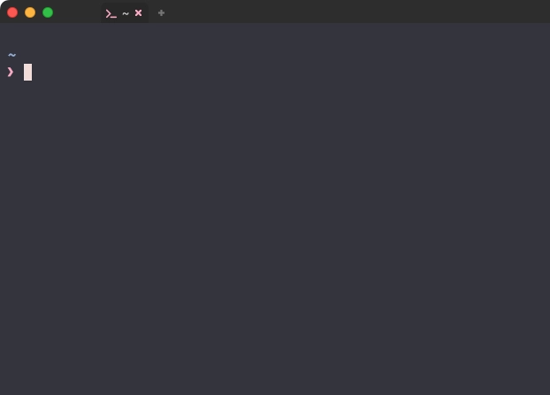
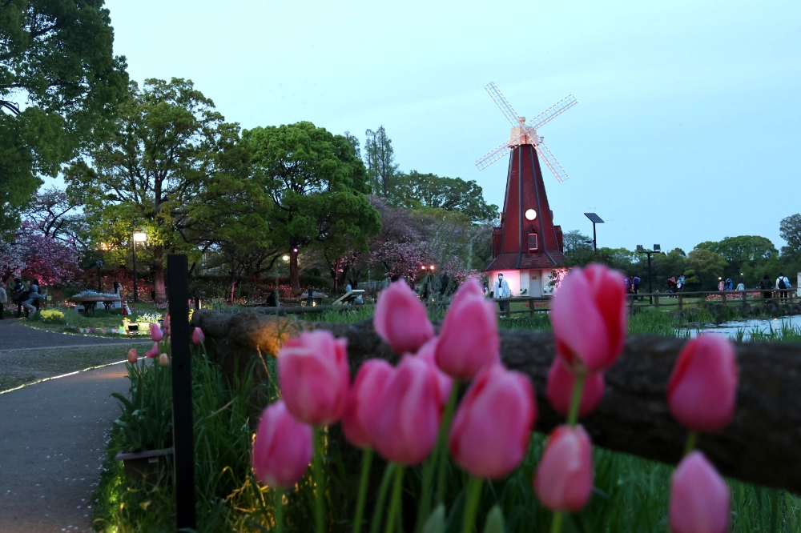

# 💻 WezTerm (meet me)

```admonish quote title=""
"March Comes in Like a Lion, and Goes Out Like a Lamb"
```

前回から間を置かず、3月の終わりに子羊のように去ろうかな〜🐑 ...とも思っていましたが、
"はるのかぜが あんなにうたっている" ことを子供たちに教えてもらったので、
これはもう春の始まりを見届けていかなきゃいけない...と、思った今日この頃でした🌸

```admonish success title=""
I look at you all, see the love there that's sleeping

While my guitar gently weeps{{footnote:
While My Guitar Gently Weeps (by [The Beatles](https://en.wikipedia.org/wiki/The_Beatles)):
George Harisson によって書かれ、彼が "眠っている愛" と呼ぶ "普遍的な愛" に対する世界の実現不可能な可能性への落胆を歌っている。

Harisson が Warrington の両親を訪ねていたときにこの曲のインスピレーションが湧き、"易経 (変化の書)" を読み始めた。
「物事は単なる偶然に過ぎないという西洋的な見方とは対照的に、
全てのものは他の全てのものに対して相対的であるという東洋的な概念に基づいているように僕には思えた」。
この相対主義という考え方を受け入れ、本を開いてたまたま最初に目にした言葉が「優しく泣く」であったことに基づいて曲を書くことにした。

1968年の春に महर्षि महेश योगी (Maharishi Mahesh Yogi) の下で超越瞑想を学んでいたインドから帰国後の The Beatles 内での不調和な雰囲気を反映している。
バンドメンバーの仲間意識の欠如に対し、
Harisson は友人の [Eric Clapton](https://en.wikipedia.org/wiki/Eric_Clapton) をレコーディングに招くことで対抗した。

9月6日、Surrey から London へ向かう車中で、Harisson は Clapton にこの曲でギターを弾いてほしいと頼んだ。

Clapton は、ソングライターとしての Harisson の才能を認めており、
その能力は長い間 Lennon と McCartney の陰に隠れていると考えていたが、それでも最初は参加を渋った。
「それはできない。The Beatles のレコードで演奏する人なんて誰もいないよ。」

結果として Clapton はリード・ギターをオーヴァーダビングしたが、その貢献については正式にクレジットされなかった。

Clapton は「"While My Guitar Gently Weeps" はグループ内での George の精神的な孤立を訴えている」と述べている。

歌詞の中で、Harisson は普遍的な愛というテーマと、
インド音楽の影響を受けた[Within You Without You](https://en.wikipedia.org/wiki/Within_You_Without_You)
のような楽曲で顕著であった哲学的な懸念を再び取り上げている。

この曲は、多くの聴衆が Harisson の作品を Lennon-McCartney の作品と互角とも言えるほど素晴らしいことに気付くきっかけとなった。
[Wikipedia](https://en.wikipedia.org/wiki/While_My_Guitar_Gently_Weeps)より
}}

君たちを見ていると、そこに眠っている愛が見える

ギターは優しく泣くんだ
```

東京での満開日は全部曇りや雨の荒々しい予報になっていたので、「なんやまだライオンおるんかいな🦁」って感じでしたね。

もう "東京に空がないといふ" とかなんとかオチつけて丸く収めたろ〜かしら、とも考えましたが...。


ありました、空🌞

そうでした、吉祥寺に「ないものは無い」のでした❗

[井の頭公園](https://www.kensetsu.metro.tokyo.lg.jp/jimusho/seibuk/inokashira/index.html)には、
もはや通ってるのかと言われるぐらい能天気に来まくってます。

ここ数ヶ月ぐらいは池のボート乗り場を改修していて、しばらくはスワン{{footnote:
Harisson は [Cream](https://en.wikipedia.org/wiki/Cream_(band)) のレコーディングに参加することで Clapton に応酬した。
「Eric が曲を書くのを手伝ったんだ。Cream のアルバムのために曲を考えなければならなかったんだけど、Eric はまだ書いていなかったんだ。
僕たちは向かい合って仕事をしていて、僕は歌詞を書いていた。Eric はそれを逆さまにして読んで、'BADGE って何だ？'
(手書きの 'Bridge' という文字を読み間違えた)。その後、酔っ払った Ringo が入ってきて、
'I told you 'bout the swans that they live in the park (白鳥が公園に住んでいることも話した)' という一節をくれたんだ。」
この時に制作された Badge は1969年、Cream の最後のアルバム Goodbye に収録された。
[The Beatles Bible](https://www.beatlesbible.com/1968/11/21/george-harrison-performs-on-badge-cream/)より
}}もボートもいませんでした。

が❗

...ご覧の通り、今じゃすっかりですよ❗🦢🦢🦢

```admonish note
駅北口のバスロータリーの真ん中に "象の銅像" がありますが、
あの[はな子](https://ja.wikipedia.org/wiki/はな子)🐘 がいたのもここです😇
```


鳥さんも羽休めに来るぐらいだし🐦‍⬛

こんなに HAPPY✨ な演奏にも巡り会えるし🎻


<audio controls preload="none">
  <source src="audio/band-sounds.mp3">
</audio>

ほらね、吉祥寺に「ないものは無い」のです🥰

わたしも大好きなばしょです😄

## ⚙️ Configuration

ぐるっと巡ってきましたが、最後は`WezTerm`の設定を少しだけ見直します🤗

`wezterm.lua`の記述方法が[あの頃](../wezterm/configuration.html)から少し進歩しているので、
まずはここから始めましょう❗

~~~admonish info title="[Configuration](https://wezfurlong.org/wezterm/config/files.html)"
```lua
-- Pull in the wezterm API
local wezterm = require 'wezterm'

-- This will hold the configuration.
local config = wezterm.config_builder()

-- This is where you actually apply your config choices

-- For example, changing the color scheme:
config.color_scheme = 'AdventureTime'

-- and finally, return the configuration to wezterm
return config
```
~~~


```admonish success title=""
I look at the floor and I see it needs sweeping

目を向ければ 床の掃除が必要な気がするんだ
```

### 🔧 config_builder

肝心なのはここですね。

```lua
-- This will hold the configuration.
local config = wezterm.config_builder()
```

`config_builder`オブジェクトを使用するように案内されています。

~~~admonish info title="[wezterm.config_builder()](https://wezfurlong.org/wezterm/config/lua/wezterm/config_builder.html)"
The config builder may look like a regular lua table but it is really a special userdata type that
knows how to log warnings or generate errors if you attempt to define an invalid configuration option.

config builder は、一見普通の lua テーブルのように見えますが、実は特別な userdata タイプで、
無効な Config オプションを定義しようとすると、警告をログに記録したりエラーを生成します。
~~~

ローカル変数名は`config`で案内されていますが、ここはなんでもいいです。

わたしはこのパターンだといつも`M`にしちゃうんで、`M`で進めていいかな...❓

~~~admonish example title="wezterm.lua"
先頭で、こんな感じでオブジェクトを定義するように変えて...。

```diff
-return {
+local wezterm = require 'wezterm'
+local M = wezterm.config_builder()
```
~~~

~~~admonish example title=""
このオブジェクトに対して色々追加していきます。例えば...

```diff
-color_scheme = 'Catppuccin Mocha',
+M.color_scheme = 'Catppuccin Mocha'

-window_background_opacity = 0.93,
+M.window_background_opacity = 0.93
```

こんな感じで書き換えていけば OK です。(末尾の`,`を取り除くのを忘れないで❗)
~~~

~~~admonish example title=""
...そしたら、最後にこのオブジェクトを返してあげましょう😌

```diff
-}
+return M
```
~~~

これで完璧😉

```admonish note
これもやっぱり`lua`の慣習なんだけど、`Matrix`(行列) のイニシャルで`M`だよね...❓

(ぶっちゃけ、ちゃんと調べたことない😮)
```

```admonish success title=""
I don't know why nobody told you

How to unfold your love

わからないんだ 誰も教えてくれなかった

どうすれば愛を伝えられる
```


[東京大神宮](https://tokyodaijingu.or.jp)もちょいちょい参拝させてもらってます⛩️


|[新見附橋](https://visit-chiyoda.tokyo/app/spot/detail/225)|
|:---|
||

|[外濠公園](https://visit-chiyoda.tokyo/app/spot/detail/274)|
|:---|
|

この辺まで来たらこっちも見て回りたくなるでしょ❓ 🚶‍♀️

### 🧚‍♀️ Font

フォントについては、このサイトでは以下のように紹介していました。

```lua
font = require("wezterm").font("Firge35Nerd Console"),
```

特に不満がなければこのままでもいいんですが、
最新のフォントを自分で追っかけたい場合なんかだと、後の項で出てくる`font_with_fall_back`を使うと良いです。

#### ⛲ FontSets

...ってことで、まずはフォントを用意しましょう❗

```admonish note
最後にして、なぜか最初の村みたいなセリフをあらかじめ...。

「ダウンロードしたフォントはインストールしないと使えないぞ❗❗」
```

##### 🪺 nerd-fonts

`nerd-fonts`は`WezTerm`に含まれているので特に設定はいらないんだけど、
[前回](../wezterm/font.html#プログラミングフォント-firge-ファージ)は`Nerd Font`が含まれている`FirgeNerd`を使う方法を紹介していました。

2024/04/17 時点では`FirgeNerd`・`WezTerm`のどちらよりも、
本家の`nerd-fonts`のバージョンはだいぶ進んでいて、
新しいアイコンも続々と増えているので、定期的に確認してみるのも楽しいと思います😆

ってことで、今回は本家の`nerd-fonts`を使った楽しいほうで進めます。

```admonish info title="[Releases](https://github.com/ryanoasis/nerd-fonts/releases)/ v3.2.0"
The Easter release. Lets see which eggs can be found:

イースターリリースだよ。どんな卵が見つかるかな:
```

```admonish note
くどいようなんですが`WezTerm`本体に既に含まれているので、
現状で不満がなければ、これを行わなくても支障はありません🐤
```

[Releases](https://github.com/ryanoasis/nerd-fonts/releases)から感謝しながら最新版をダウンロードしましょう😉

好きなたまご🥚 を選べば良いのですが、このページでは`NerdFontsSymbolsOnly`を使って進めていきます。

```admonish tip
`NerdFontsSymbolsOnly.tar.xz`もしくは`NerdFontsSymbolsOnly.zip`は、文字通りシンボルオンリーです🐣
```

##### ❤️‍🔥 FiraCode

で、次に英字フォントを用意するんですが、ここでは一例として`FiraCode`を紹介します。

```admonish info title="[FiraCode](https://github.com/tonsky/FiraCode)"
Fira Code: free monospaced font with programming ligatures

Fira Code: プログラミング合字のフリー等幅フォント
```

これも素直に[Releases](https://github.com/tonsky/FiraCode/releases)から感謝しながらダウンロードするのが簡単でしょう😊

##### 🎏 ヒラギノ角ゴシック

これだけだと "漢字・ひらがな・カタカナ" がイマイチに戻っちゃうので、日本語に対応したフォントも用意しましょう。

わたしは`macOS`に標準で入っている`ヒラギノ角ゴシック`を使っているので、ここでは特に示せる手順がありません😅

#### 🐣 font_with_fall_back

フォントが用意できたら、これらを`WezTerm`で使うために`font_with_fall_back`を設定しましょう❗

~~~admonish info title="[wezterm.font_with_fallback(families [, attributes])](https://wezfurlong.org/wezterm/config/lua/wezterm/font_with_fallback.html)"
This function constructs a lua table that configures a font with fallback processing.
Glyphs are looked up in the first font in the list but if missing the next font is checked and so on.

この関数は、フォールバック処理でフォントを設定する lua テーブルを構築します。
グリフはリストの最初のフォントで検索されますが、見つからない場合は次のフォントがチェックされます。

The first parameter is a table listing the fonts in their preferred order:

最初のパラメータは、フォントを優先する順番に並べたテーブルです：

```lua
local wezterm = require 'wezterm'

return {
  font = wezterm.font_with_fallback { 'JetBrains Mono', 'Noto Color Emoji' },
}
```
~~~

これで、複数のフォントを好きなように組み合わせて使用することができます😌

~~~admonish example title="wezterm.lua"
まずはこんな感じで書き換えてから...、

```diff
- font = require("wezterm").font("Firge35Nerd Console"),
+ M.font = wezterm.font_with_fallback {
+ }
```
~~~

~~~admonish example title=""
このリストに前節で用意したフォントを追加します😽

```diff
 M.font = wezterm.font_with_fallback {
+ 'Fira Code',
+ 'ヒラギノ角ゴシック',
+ 'Symbols Nerd Font',
 }
```
~~~

~~~admonish tip
`macOS`の場合は、さらにこんなのを入れておくのもいいかも...❓

```diff
 M.font = wezterm.font_with_fallback {
  'Fira Code',
  'ヒラギノ角ゴシック',
  'Symbols Nerd Font',
+ 'Apple Color Emoji',
 }
```

他の`OS`でも似たようなフォントセットがあるのかどうかは、わたしがよく知らないのでごめんなさい😿
~~~

綺麗に表示できたかな❓☺️


### 🪟 Window

「そういえばライトアップされた桜をまだ見てないな〜」と気づきました。

満開日もとうに過ぎて、おまけに雨も降っちゃったんで、もう無理かなーとも思いましたが...。

ありました、[八芳園](https://www.happo-en.com)🌝


場所が白金台なので、ちょっと前のわたしならビビり散らかしちゃうことこの上なし❗

...でしたが、安心してください❗

今のわたしは "とやマネーゼ"...❗

"6000 とやマネーゼ" なのです🥴

```admonish success title=""
I look at the world and I notice it's turning

目を向ければ 世界が変わりつつあることに気づいたんだ
```

たとえ "億万シロカネーゼ" と並んでも互角であることに疑いの余地はありません❗

ごめんあそばせ〜🤭


```admonish success title=""
I don't know how someone controlled you

They bought and sold you

わからないんだね 操られていることが

君は誰かに 売られて 買われてる
```

#### 💖 window_decorations

```admonish info title="[window_decorations](https://wezfurlong.org/wezterm/config/lua/config/window_decorations.html)"
- `window_decorations = "INTEGRATED_BUTTONS|RESIZE"` - place window management buttons (minimize, maximize, close) into the tab bar instead of showing a title bar.

タイトルバーを表示する代わりに、ウィンドウ管理ボタン (最小化、最大化、閉じる) をタブバーに配置する。
```

これは面白いので、ぜひ取り入れてみましょう😆

~~~admonish example title="wezterm.lua"
```diff
-window_decorations = 'RESIZE',
+M.window_decorations = 'INTEGRATED_BUTTONS|RESIZE'
```
~~~

そしたら [Configuring Mouse Assignments](../wezterm/window-decorations.html#configuring-mouse-assignments)
で書いた、タイトルバーを操作するためのコードはもう、ぽいっちょ❗うるのねん❗

~~~admonish example title="mousebinds.lua"
```diff
 return {
   mouse_bindings = {
-    {
-       event = { Down = { streak = 1, button = 'Left' } },
-       mods = 'NONE',
-       action = act.EmitEvent 'show-title-bar',
-    },
   },
 }
```
~~~

~~~admonish example title="event.lua"
```diff
- local TITLE_BAR_DISPLAY_TIME = 3000
```

```diff
- function DisableWindowDecorations(window, interval)
-   if interval then
-     wezterm.sleep_ms(interval)
-   end
-
-   local overrides = window:get_config_overrides() or {}
-   overrides.window_decorations = nil
-   window:set_config_overrides(overrides)
- end
```

```diff
- wezterm.on('window-focus-changed', function(window, pane)
-   if window:is_focused() then
-     return
-   end
-
-   DisableWindowDecorations(window)
- end)
```

```diff
- wezterm.on('show-title-bar', function(window, pane)
-   local overrides = window:get_config_overrides() or {}
-
-   overrides.window_decorations = 'TITLE | RESIZE'
-   window:set_config_overrides(overrides)
- end)
```
~~~

...ってやれば、こんな外観になるはずです🍦

|||
|:---:|:---:|
|**before**|
|**after**||

このサイトでも、もう散々この状態でスクリーンショットを載せてるんですけどね❗

```admonish note
[Status Bar](../wezterm/status.html)に表示していた項目は、各々でうまく調整してください😅

(特に[Left Status](../wezterm/left-status.html)は邪魔に見えちゃってるかもしれない...。)
```

```admonish success title=""
With every mistake, we must surely be learning{{footnote:
Bridge の間、Harisson は [Bob Dylan](https://en.wikipedia.org/wiki/Bob_Dylan) 風の繰り返しの韻律を採用し、
人々がいかにこの愛を顕在化させる能力から遠ざかってしまったかを伝えている。
}}

全ての過ちに、学び取るものがあるはずなんだ
```

## 🎁 Wrap Up

まあ、無理やり詰め込んだ感じも否めないけど、これでわたしがやりたかった事は大体やれたかな❗

この章も、ちょっと注釈みたいなの並べてさっさと終わるものだと思っていたんだけど、なんか気づけばガッツリやってました😅

```admonish success title=""
I don't know how you were diverted

You were perverted, too

わからないんだ 君がどのように逸れてしまったのか

歪んでしまったんだ、君も
```

...でも、ちゃんと[やり遂げる](outroduction.html)ことが出来ただろう❓😏

新しいことを始めるのもいいし、今やっていることのレベルを上げるのもいいし...。

そろそろみんな次のステップに進まないとね😆

## 🎸 While My Guitar Gently Weeps

な〜んて言いながら、もう一回だけ話飛ぶんですけど、オランダに行ってきたんですよ〜😋




間違えました、[いたばしのオランダ](https://www.city.itabashi.tokyo.jp/bousai/toshikeiakku/kotsu/1044242/1044694.html)でした🦧

```admonish success title=""
I don't know how you were inverted

No one alerted you

わからないんだ 君がどのように倒錯してしまったのか

誰も君に言ってくれなかったんだ
```

色々開き直って、ず〜っとすっとぼけながらここまで来たんだけど、結局何が言いたいかっていうとね...、

```admonish quote title="🪸 Thanks for reading !"
前を向いて、まわりに目を向けてごらん。

...ほら❗わるくないだろ❓🤗{{footnote: この言い回しはもちろん John Lennon のまね〜🤪}}

```

### 🎸 Still, my guitar gently weeps

```admonish success title=""
見るに見兼ねてなのか、なんかもう自分が「耐えられまへん」なのかもしれないんだけど、
縁あって再登場だ。{{footnote: 2024/08 追記。}}

> When you’re through with life
>
> And all hope is lost
>
> きみが全てを尽くして
>
> 目の前が真っ暗になったとしても

いや、知ってるよ。大人達が「下がった」だの「落ちた」だの騒いでるのは 🫠

なんならわたしも巻き込まれてるし🙃

> And when the night is cloudy
>
> たとえ夜が曇っていたとしても

なんなら 9020.T も持ってるし🤣

でも、"ドンドンぶち上がる" 花火を見てる方がよっぽど健全だと気づいたんだ❗

<video controls preload="none" width="1280" height="720" poster="img/itabashi-hanabi-thumbnail.webp">
  <source src="img/itabashi-hanabi.webm" type="video/webm">
  Your browser does not support the video/webm.
</video>

> There is still a light that shines on me
>
> それでも僕を照らす光はある

...ほら❗わるくないだろ❓🤗

> 悩みなんざ吹っ飛ばせ！
>
> 笑え 笑え！
```
