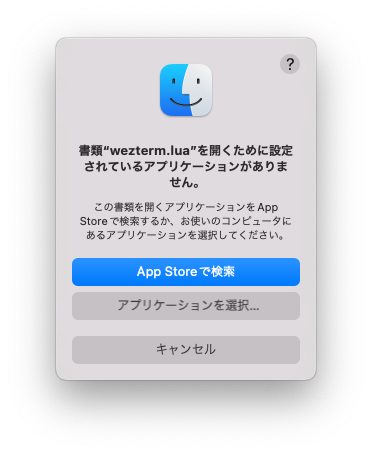
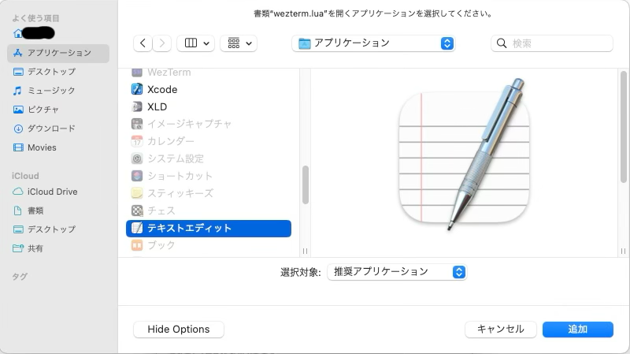

# Base Settings

特に難しいことを考えずに ホームフォルダに `.wezterm.lua` を置いても良いのですが、
後々ファイルを複数配置していくので、`$HOME/.config/wezterm`というディレクトリを作って、そこに `wezterm.lua` を置くほうがおすすめです。

以下のようにしてみましょう。

~~~admonish example title="$HOME/.config/wezterm/wezterm.lua"
```lua
return {

}
```
~~~

```admonish success
最初はこんなものです。できたら次のページへ進みましょう。
```

もし、手順が必要なら下へ。

## 手順

以下のコマンドを順に実行してください。

~~~admonish quote title="ディレクトリを作る"
```sh
mkdir -p ~/.config/wezterm
```
~~~

~~~admonish quote title="テキストを編集する(以下の例では`vim`を使用)"
```sh
vim ~/.config/wezterm/wezterm.lua
```
~~~

~~~admonish info title="GUI のエディタを使う場合"
GUI のエディタを使用したい場合は以下で出来ます。`lua`ファイルに関連付けられたアプリケーションが起動するはずです。

ファイルを作る:
```sh
touch ~/.config/wezterm/wezterm.lua
```

ファイルを開く:
```
open ~/.config/wezterm/wezterm.lua
```

もし、こんなのが出てきたら



普段使っているエディタを選びましょう。

`Xcode`や`Visual Studio Code`などでもいけるはずです。

~~~

```admonish success
できましたね!! それでは次のページへ進みましょう。
```
