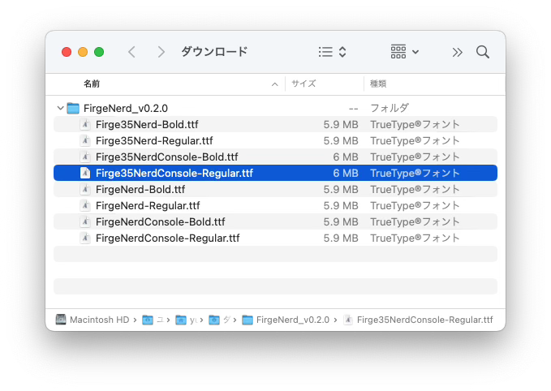
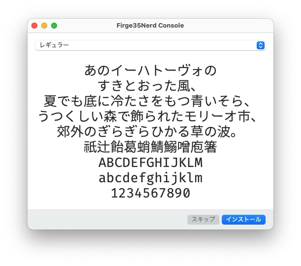
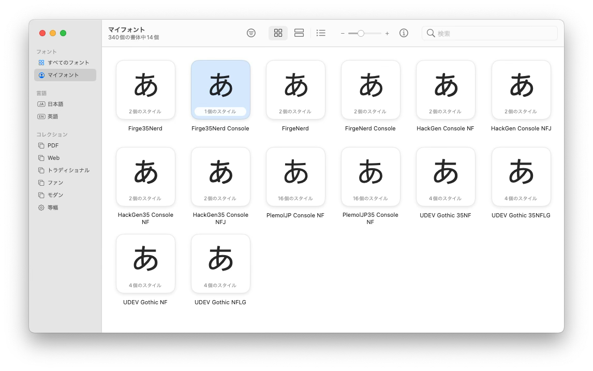
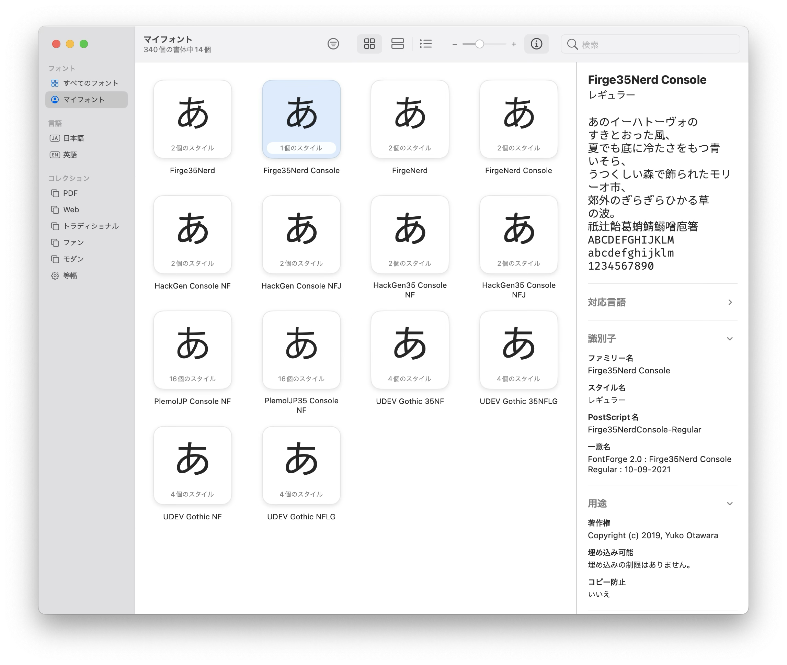
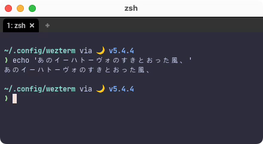

# Font 
基本的には好きなフォントを使ってもらえれば良いのですが、
`starship`の Prerequisites を満たしてあげたいので、`Nerd Font`から選ぶのがポイントです。

```admonish info
わたしが深く理解しているわけではないので上手く説明できませんが、

要は基本的な文字「あ」とか「意」とか 「abc」 とか「!@#」などに加えて特殊な記号フォントを加えたものです。

月、出てましたよね。あれです😆
```

## ダウンロード
例として、わたしが普段お世話になっているフォントを紹介します。

```admonish note title="[GitHub - yuru7/Firge](https://github.com/yuru7/Firge)"
Fira Mono と源真ゴシックを合成したプログラミングフォント Firge (ファージ)
```

「ダウンロードはこちら」というリンクから、お言葉に甘えて`FirgeNerd_v0.2.0.zip`をダウンロードしましょう。感謝😀

## インストール
フォントのインストールは OS の作業になるので、`macOS`のやり方だけ軽く載せます。

...基本的にはどのOSでも、ダウンロードしてきたファイルを開けば「インストールしますか？」的なの出てきますよね。多分。

やればできる!!





ほらできた🤗

## WezTerm 設定
で、このフォントを`WezTerm`に設定すれば良さそう。

```admonish note title="[wezterm.font](https://wezfurlong.org/wezterm/config/lua/wezterm/font.html)"
This function constructs a lua table that corresponds to the internal FontAttributes struct that is used to select a single named font.

この関数は、単一の名前付きフォントを選択するために使用される内部 FontAttributes 構造体に対応する lua テーブルを構築します。
```

~~~admonish example title="wezterm.lua"
```lua
-- 説明簡略のためサンプルとは少し記述を変えてますが、どちらでも構いません。
font = require("wezterm").font("Firge35Nerd Console"),
```
~~~

わたしは`Firge35NerdConsole-Regular.ttf`をインストールして、wezterm にファミリー名の`Firge35Nerd Console`を指定しています。

```admonish info
ファミリー名は Font Book 等で確認できます。「情報を確認する(`command + i`)」ですね。

```

フォントサイズも指定できるので一緒に入れておきましょう。

```admonish note title="https://wezfurlong.org/wezterm/config/lua/config/font_size.html"
Specifies the size of the font, measured in points.

You may use fractional point sizes, such as 13.3, to fine tune the size.

フォントのサイズをポイント数で指定します。

13.3 のような小数点のサイズを使用して、サイズを微調整することができます。
```

~~~admonish example title="wezterm.lua"
```lua
font_size = 12.0,
```
~~~

上の例はデフォルト値そのままですが、お好みで調整してください。

```admonish success
どうでしょう？明らかに日本語が綺麗になりましたね❗️

Roboto:



Firge35Nerd Console:


やったね🤗
```
