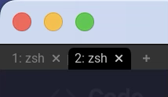

# Window Frame
コンソールがいい感じになってきたので、次はウィンドウフレーム周りの設定をしていきましょう。

```admonish info title="[window_frame - Wez's Terminal Emulator](https://wezfurlong.org/wezterm/config/lua/config/window_frame.html)"
This setting is applicable primarily on Wayland systems when client side decorations are in use.

この設定は、主にクライアント側の装飾が使用されているWaylandシステムで適用されます。
```
とのことなのですが、私はここはデフォルトでいいかなーって思ってるのでほぼ何もしていません。

...いや、一回細かく変えてみたこともあったんですが、最終的にはデフォルトでいいかーってなりました。


## Font
これもほぼデフォルトのままで、フォントサイズだけ変える程度にしています。

前回やっているフォント設定と同じですね。

```admonish info title="[Native (Fancy) Tab Bar appearance](https://wezfurlong.org/wezterm/config/appearance.html#native-fancy-tab-bar-appearance)"
The following options affect the fancy tab bar:

次のオプションは、ファンシータブバーに影響します。
```

~~~admonish example title="wezterm.lua"
```lua
window_frame = {
  -- デフォルト値のままなので記述しなくても平気ですが、後で変えたくなった時にわかりやすいので。
  font = wezfont 'Roboto',
  -- サイズはだいぶ小さくしちゃってます。
  font_size = 8.0,
},
```
~~~

## Fancy or Retro
前項で、突然ファンシータブバーという文言が出てきましたが、`WezTerm`のタブバーには、ファンシーとレトロの2種類があります。

```admonish info title="[use_fancy_tab_bar](https://wezfurlong.org/wezterm/config/lua/config/use_fancy_tab_bar.html)"
When set to true (the default), the tab bar is rendered in a native style with proportional fonts.

true（デフォルト）に設定すると、タブバーはプロポーショナルフォントを使用したネイティブスタイルでレンダリングされます。

When set to false, the tab bar is rendered using a retro aesthetic using the main terminal font.

false に設定すると、タブバーはメインのターミナルフォントを使用したレトロなスタイルで表示されます。
```

わたしはファンシー派かなぁ😆 なので何もしません。

レトロ派の方は以下を記述しましょう。

~~~admonish example title="wezterm.lua"
```lua
use_fancy_tab_bar = false
```
~~~

before:


after:



```admonish success
ごめんなさい。全然中身ありませんでしたね😅 まあ、小休止ってことで。

次はキーバインドを変えてみましょう。
```
