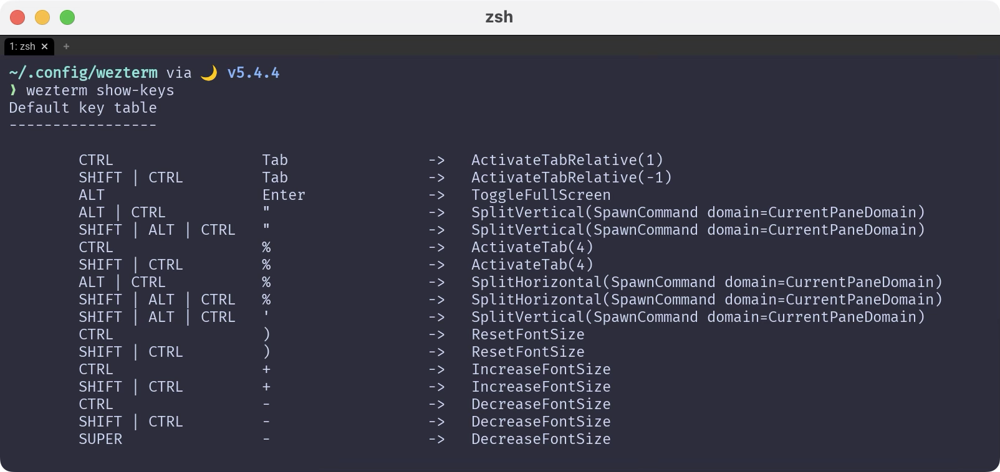

# Keybind
ここはちょっと説明が難しいというか、どこまで`WezTerm`をメインに持ってくるのかみたいなところがあります。

例えば`tmux`。

`WezTerm`自体が`tmux`と同等かそれ以上の機能を持っているので、
`WezTerm`に対して`tmux`と同じキーバインドを与えてしまえば、これは不要になるわけです。[^a]

と言っても完全にローカルでしか使わない人間だから大丈夫なだけで、ネットワークを介して使う場合には問題もあるかもしれません。

実際、デフォルトでは徹底的に他のソフトウェアとの衝突を避けています。

```admonish note title="[Default Key Assignments](https://wezfurlong.org/wezterm/config/default-keys.html)"
The default key assignments are shown in the table.

デフォルトのキー割り当ては、表のとおりです。
```

## 現在のキーバインド確認

まずは現在のキーバインドがどうなっているのかを確認します。

```admonish note title="[show-keys](https://wezfurlong.org/wezterm/cli/show-keys.html#wezterm-show-keys)"
Prints the complete set of key assignments based on your config file.

設定ファイルに基づいたキー割り当ての完全なセットを表示します。
```

実行してみましょう。そのまま`WezTerm`で`wezterm`コマンドを使えば良いです。

~~~admonish quote title="Command"
```sh
wezterm show-keys
```
~~~



そう、これが現在のキーバインドですね。

## キーバインドカスタマイズ下地

で、ここで提案なんですが、一度自分の設定ファイルに落とし込んじゃったらどうかな？と思うわけです。

それをやるにはどうすれば簡単かな〜っていう話になるんですけど、方法はすでにありました。

~~~admonish quote title="Command"
```sh
wezterm show-keys --lua
```
~~~


さすがですね。もはやレールは存在していました。これを`keybinds.lua`に持っていけば良いだけです。

これはもうプロっぽく片付けましょう。シェル芸というやつです✨
~~~admonish quote title="Command"
```sh
wezterm show-keys --lua > keybinds.lua
```
~~~
```admonish warning
上記コマンドのファイル出力先は現在のディレクトリです。

`~/.config/wezterm`に移動するか、出力先を`~/.config/wezterm/keybinds.lua`に指定してください。
```

これだけでもう直接流し込めちゃうんですね。簡単〜。

## 読み込み先を切り替える
ここまでは暗黙的にデフォルト設定が適用されていましたが、これからは自分で作った`keybinds.lua`を使っていきましょう。

~~~admonish example title="wezterm.lua"
```lua
keys = require(“keybinds”).keys,
```
~~~

冒頭のリンクを再掲しますが、一番下にこのようにあります。

```admonish note title="[Default Key Assignments](https://wezfurlong.org/wezterm/config/default-keys.html)"
If you don't want the default assignments to be registered, you can disable all of them with this configuration; if you chose to do this, you must explicitly register every binding.

デフォルトの割り当てを登録したくない場合は、この設定ですべての割り当てを無効にできます。これを選択した場合は、すべてのバインディングを明示的に登録しなければなりません。
```

デフォルト設定は以下で完全に無効化されます。不安に感じるようであればスキップしても大丈夫です。
~~~admonish example title="wezterm.lua"
```lua
disable_default_key_bindings = true,
```
~~~

```admonish success
これでキーバインドの移行が完了しました。まあ、まだ中身は同じなんですけどね。

さて、もう一つのポイントとして leader キーというものがあります。これについてはまた次回。
```

[^a]:実際、わたしも`WezTerm`を使う前は`iTerm2`の上で`tmux`を動かしていました。
