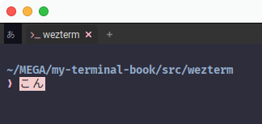
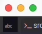
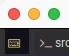

# Left Status

まずはステータスバーの左側を活用していきましょう😆

## キーボード状態
わたしが使っているのはキーボード状態です。ひとまずコードはこんな感じ。

~~~admonish example title="status.lua"
```lua
local DEFAULT_FG = { Color = '#9a9eab' }
local DEFAULT_BG = { Color = '#333333' }

local SPACE_1 = ' '
local SPACE_3 = '   '

local HEADER_KEY_NORMAL = { Foreground = DEFAULT_FG, Text = '' }
local HEADER_LEADER = { Foreground = { Color = '#ffffff' }, Text = '' }
local HEADER_IME = { Foreground = DEFAULT_FG, Text = 'あ' }

local function AddIcon(elems, icon)
  table.insert(elems, { Foreground = icon.Foreground })
  table.insert(elems, { Background = DEFAULT_BG })
  table.insert(elems, { Text = SPACE_1 .. icon.Text .. SPACE_3 })
end

local function GetKeyboard(elems, window)
  if window:leader_is_active() then
    AddIcon(elems, HEADER_LEADER)
    return
  end

  AddIcon(elems, window:composition_status() and HEADER_IME or HEADER_KEY_NORMAL)
end
```
~~~

`SPACE_3`とかは自分でもちょっとマヌケだとは思ってますが、なんかごめんなさい...😿

まだ`update-status`と繋いでないので動きませんが、ここで一旦区切って補足します。

ここでは以下の状態を可視化します。

- `leader`キーアクティブ
- IME

## Leaderキーアクティブ
まずは`leader`キーの状態を以下で取得します。

```admonish info title="[window:leader_is_active](https://wezfurlong.org/wezterm/config/lua/window/leader_is_active.html)"
Returns true if the Leader Key is active in the window, or false otherwise.

リーダーキーがウィンドウ内でアクティブな場合はtrueを、そうでない場合はfalseを返します。
```

上のコード例では、`leader`キーがアクティブである場合はIMEよりも優先して表示します。

## IME状態
次にIME状態です。

```admonish info title="[window:composition_status()](https://wezfurlong.org/wezterm/config/lua/window/composition_status.html)"
Returns a string holding the current dead key or IME composition text, or nil if the input layer is not in a composition state.

This is the same text that is shown at the cursor position when composing.

現在のデッドキーまたはIMEのコンポジションテキストを保持する文字列、または入力レイヤーがコンポジション状態でない場合はnilを返します。

これは、コンポジション時にカーソル位置に表示されるテキストと同じものです。
```
`GetKeyboard()`では、`window:composition_status()`の結果が`nil`か否かでアイコンの色を変えてます。

```admonish note
コンポジションって何だ？🤔と思われるかもしれませんが、わたしも思ってます。

でも、この状態を指すようです。



ちょっとフライングしてますが、左上に`あ`と出てるのが`composition_status()`で`nil以外`が返ってきている状態です。

(`nil`でない場合は文字列が入りますが、この例では使用していません。)
```

さて、それでは`update-status`に繋ぎ込みましょう😄

~~~admonish example title="status.lua"
```lua
local function LeftUpdate(window, pane)
  local elems = {}

  GetKeyboard(elems, window)

  window:set_left_status(wezterm.format(elems))
end

wezterm.on('update-status', function(window, pane)
  LeftUpdate(window, pane)
end)
```
~~~

normal:



leader key is active:



composition:


```admonish success
こんなもんですね。動きが出て楽しいですね😆 ...ね❗️ね❗️
```
