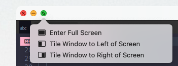
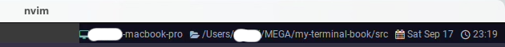

# Right Status

これはもう手厚いサンプルが既に用意されているので、この通りに書けばバッチリです。やったね！

```admonish info title="[window:set_right_status(string)](https://wezfurlong.org/wezterm/config/lua/window/set_right_status.html)"
This method can be used to change the content that is displayed in the tab bar, to the right of the tabs and new tab button. 

このメソッドを使用すると、タブバー内のタブと新規タブボタンの右側に表示される内容を変更することができます。
```
ただ、わたしの設定例にお付き合いいただける方のために、もうちょっとだけ続きます。

## My Customize
まずは wez さんのサンプルコードをほぼ丸写しですが、一つずつ機能を分けます。

```admonish warning
先に下記のコードを載せていますが、いくつか未定義なものがあるので、これだけだとエラーになっちゃいます。
```

~~~admonish example title="status.lua"
```lua
local function GetHostAndCwd(elems, pane)
  local uri = pane:get_current_working_dir()

  if not uri then
    return
  end

  local cwd_uri = uri:sub(8)
  local slash = cwd_uri:find '/'

  if not slash then
    return
  end

  local host = cwd_uri:sub(1, slash - 1)
  local dot = host:find '[.]'

  AddElement(elems, HEADER_HOST, dot and host:sub(1, dot - 1) or host)
  AddElement(elems, HEADER_CWD, cwd_uri:sub(slash))
end

local function GetDate(elems)
  AddElement(elems, HEADER_DATE, wezterm.strftime '%a %b %-d')
end

local function GetTime(elems)
  AddElement(elems, HEADER_TIME, wezterm.strftime '%H:%M')
end

local function GetBattery(elems, window)
  if not window:get_dimensions().is_full_screen then
    return
  end

  for _, b in ipairs(wezterm.battery_info()) do
    AddElement(elems, HEADER_BATTERY, string.format('%.0f%%', b.state_of_charge * 100))
  end
end
```
~~~

wez さんのサンプルでは一度に取得していた date と time も分けちゃってます。

程度は分かりませんが、非効率ではあると思われるのでお好みで。

バッテリー表示については、わたしの場合はフルスクリーンの時だけ出しています。スクリーン状態は下記で取得できます。

```admonish info title="[window:get_dimensions()](https://wezfurlong.org/wezterm/config/lua/window/get_dimensions.html)"
The table has the following fields:

テーブルには以下のフィールドがあります:

pixel_width, pixel_height, dpi, is_full_screen
```

ここでは`is_full_screen`を使います。フルスクリーン時は true が返ります。

```admonish warning
`WezTerm`の[ToggleFullScreen](https://wezfurlong.org/wezterm/config/lua/keyassignment/ToggleFullScreen.html)を使用してフルスクリーンにしている場合は反応してくれないようです。

OSからフルスクリーン化した時はちゃんと反応します。


```

で、以下が足りていなかった定義です。

~~~admonish example title="status.lua"
```lua
-- ここもやっぱりアイコン入れてます
local HEADER_HOST = { Foreground = { Color = '#75b1a9' }, Text = '' }
local HEADER_CWD = { Foreground = { Color = '#92aac7' }, Text = '' }
local HEADER_DATE = { Foreground = { Color = '#ffccac' }, Text = '' }
local HEADER_TIME = { Foreground = { Color = '#bcbabe' }, Text = '' }
local HEADER_BATTERY = { Foreground = { Color = '#dfe166' }, Text = '' }

local HEADER_KEY_NORMAL = { Foreground = DEFAULT_COLOR, Text = '' }
local HEADER_LEADER = { Foreground = { Color = '#ffffff' }, Text = '' }
local HEADER_IME = { Foreground = DEFAULT_COLOR, Text = 'あ' }

local function AddElement(elems, header, str)
  table.insert(elems, { Foreground = header.Foreground })
  table.insert(elems, { Text = header.Text .. SPACE_1 })

  table.insert(elems, { Foreground = DEFAULT_COLOR })
  table.insert(elems, { Text = str .. SPACE_3 })
end
```
~~~

引っ張った割には特に説明するところもないですね...。そのまま完成させちゃいましょう😆

~~~admonish example title="status.lua"
```lua
local function RightUpdate(window, pane)
  local elems = {}

  GetHostAndCwd(elems, pane)
  GetDate(elems)
  GetTime(elems)
  GetBattery(elems, window)

  window:set_right_status(wezterm.format(elems))
end

wezterm.on('update-status', function(window, pane)
  -- 冗長に見えるかもしれませんが、Left Status の設定を後で入れるのでこうなってます。
  RightUpdate(window, pane)
end)
```
~~~


さて、これでこんな感じになったはずなんですがどうでしょうか？右上です。



フルスクリーン時にバッテリー表示もされているでしょうか？


```admonish success
華やかになりましたね。

(ぶっちゃけそんな見ないんだけど) サンプル通りとはいえ、自分で書いたコードが動くんだから楽しい世界ですよね〜。

ほわほわ〜☺️
```
