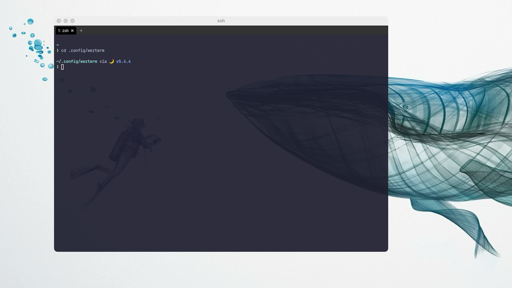

# Shell Prompt

`WezTerm`の設定からは少し逸れますが、先にシェルプロンプトのカスタマイズをやってしまいましょう。

## Starship
技術系サイトを見ていると、こぞって紹介されている感のある`starship`です。

まあ、これは紹介したくなりますよね〜。導入が簡単なのに綺麗だし。

```admonish note title="[StarShip Cross-Shell Prompt](https://starship.rs/)"
The minimal, blazing-fast, and infinitely customizable prompt for any shell!

あらゆるシェルのための、最小限の、高速な、そして無限にカスタマイズ可能なプロンプト!
```
ページ内の Get Started からインストール方法が確認できます。

覗いてみると
```
Prerequisites
- A Nerd Font installed and enabled in your terminal.

前提条件
- Nerd Fontがインストールされ、端末で有効になっていること。
```
と書いてありますね。

本来なら「なんかめんどくさそうだな〜」となるところですが安心してください。入ってますよ。

`WezTerm`には`Roboto`というフォントがビルトインされているのですが、これが`Nerd Font`の仲間なんですね。

```admonish note title="[Google Fonts > Roboto](https://fonts.google.com/specimen/Roboto)"
Designed by Christian Robertson
```

`WezTerm`のフォント設定を変えていなければデフォルトで`Roboto`が使用されているので「安心してください」となるわけです。

...とは言いつつ、わたしは別のフォントを使っているので`3.3 Font`で紹介します。

## インストール

これは`starship`の説明通りにやっていけば大丈夫ですね。

### Step 1.
ターミナルから
~~~admonish quote title="Command"
```sh
curl -sS https://starship.rs/install.sh | sh
```
~~~
と、やってもいいのですが、わたしは`homebrew`でやっちゃいます。

~~~admonish quote title="Command"
```sh
brew install starship
```
~~~

いきなり説明通りから外れましたね！どんまい✨

### Step 2.
`zsh`を使っている場合は`~/.zshrc`に以下を追記するだけです。

~~~admonish example title=".zshrc"
```sh
`eval "$(starship init zsh)"`
```
~~~

```admonish info
もし無かったら自分で作っちゃっていいやつです。
```

```admonish warning
繰り返しますが「追記」です。先に記述されているものがあった場合、それは消さないでください。
```

### Step 3.
コンフィグファイルは、また別の機会に。`WezTerm`を一旦終了して再度起動し直しましょう。


`3.1 Window`で設定したカラースキームが適用されているのを確認できましたね。

あと、月が綺麗ですね。(`wezterm`ディレクトリに行くと手っ取り早く見られます。)

```admonish success
満足💕
それでは`WezTerm`に戻りましょう。
```
