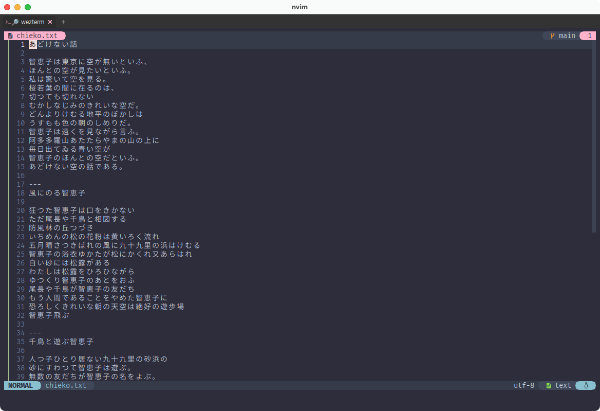

# Tab

さて、引き続き`format.lua`に追記していきましょう。今回はタブタイトルです。

~~~admonish example title="format.lua"
```lua
local HEADER = '' -- 文字化けしちゃってるかもしれませんが、アイコンフォント入ってます。

local SYMBOL_COLOR = { '#ffb2cc', '#a4a4a4' }
local FONT_COLOR = { '#dddddd', '#888888' }
local BACK_COLOR = '#2d2d2d'
local HOVER_COLOR = '#434343'

wezterm.on('format-tab-title', function(tab, tabs, panes, config, hover, max_width)
  local index = tab.is_active and 1 or 2

  local bg = hover and HOVER_COLOR or BACK_COLOR
  local zoomed = tab.active_pane.is_zoomed and '🔎 ' or ' '

  return {
    { Foreground = { Color = SYMBOL_COLOR[index] } },
    { Background = { Color = bg } },
    { Text = HEADER .. zoomed },

    { Foreground = { Color = FONT_COLOR[index] } },
    { Background = { Color = bg } },
    { Text = tab.active_pane.title },
  }
end)
```
~~~

これもウィンドウタイトルと同じように、`wezterm.on`を使って`format-tab-title`イベントの処理を書いています。

色は適宜調整してください。

```admonish info title="[format-tab-title](https://wezfurlong.org/wezterm/config/lua/window-events/format-tab-title.html)"
The format-tab-title event is emitted when the text for a tab title needs to be recomputed.

format-tab-title イベントは、タブタイトルのテキストを再計算する必要があるときに発行されます。
```

これもウィンドウタイトルとほぼ同じですね。

所々で状態によって表示するものを変えていますが、やっていることは`zoomed`と`hover`の可視化ですね。

## タブタイトル
上にある例では表示する内容は特に加工していませんが、前回作った`BaseName`に通すのもスッキリしてオススメです。

~~~admonish example
```lua
return {}

  〜

  { Text = BaseName(tab.active_pane.title) },
}
```
~~~

## Zoomed
ズーム中はタブに 🔎 アイコンを表示してます。 

```admonish info title="[TogglePaneZoomState](https://wezfurlong.org/wezterm/config/lua/keyassignment/TogglePaneZoomState.html)"
Toggles the zoom state of the current pane.
A Zoomed pane takes up all available space in the tab, hiding all other panes while it is zoomed.

現在のペインのズーム状態をトグルします。
ズームされたペインは、タブ内で利用可能な全てのスペースを占め、ズーム中は他のペインが全て非表示になります。
```

デフォルトのキーバインドだとズーム機能が割り当てられていないと思うので、`keybinds.lua`に入れておきましょう。

~~~admonish example title="keybinds.lua"
```lua
{ key = 'Z', mods = 'CTRL', action = act.TogglePaneZoomState },
```
~~~

使い方としてはまあ、こんな感じになってたとして...


上のペインにいる状態でズームすると...



"ズーム中は他のペインが全て非表示になります。"というドキュメントどおり😏

左上に 🔎 アイコンが出ていることも確認できましたね。

もう一度同じ操作で戻ります。

(ペイン操作については`3.6 Leader Key`でふわっと話題にしました。)

## Hover
ホバー中は該当のタブ背景色を少し変えてます。

```admonish info title="[hover](https://wezfurlong.org/wezterm/config/lua/window-events/format-tab-title.html)"
true if the current tab is in the hover state

現在のタブがホバー状態である場合に true を返します。
```

## 少しluaのお話
~~~admonish example
```lua
local SYMBOL_COLOR = { '#ffb2cc', '#a4a4a4' }
local FONT_COLOR = { '#dddddd', '#888888' }

local index = tab.is_active and 1 or 2

{ Foreground = { Color = SYMBOL_COLOR[index] } },
```
~~~

lua の配列は`[1]`始まりなので、(Cとかは`[0]`から始まりますよね。)
三項演算子`local index = tab.is_active and 1 or 2`によって`SYMBOL_COLOR`配列と`FONT_COLOR`配列それぞれから採用する色を切り替えます。

`else`節を消せるだけ消す書き方、わたしは好きなんですがどうでしょう?


```admonish success
だんだん洗練されてきましたね。いよいよ大詰めです。
```
