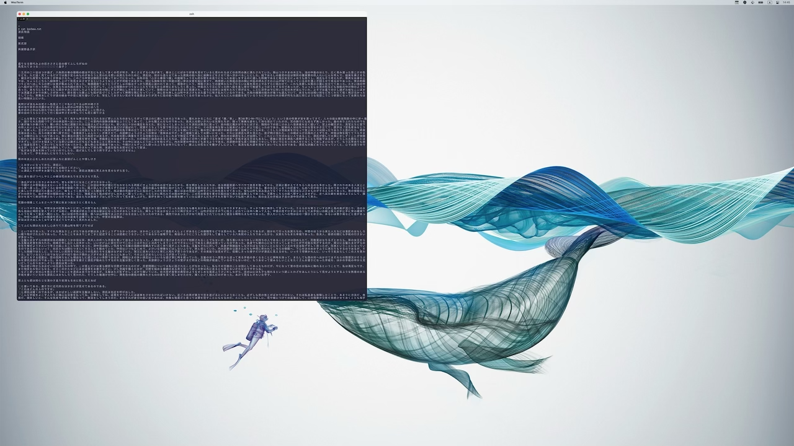
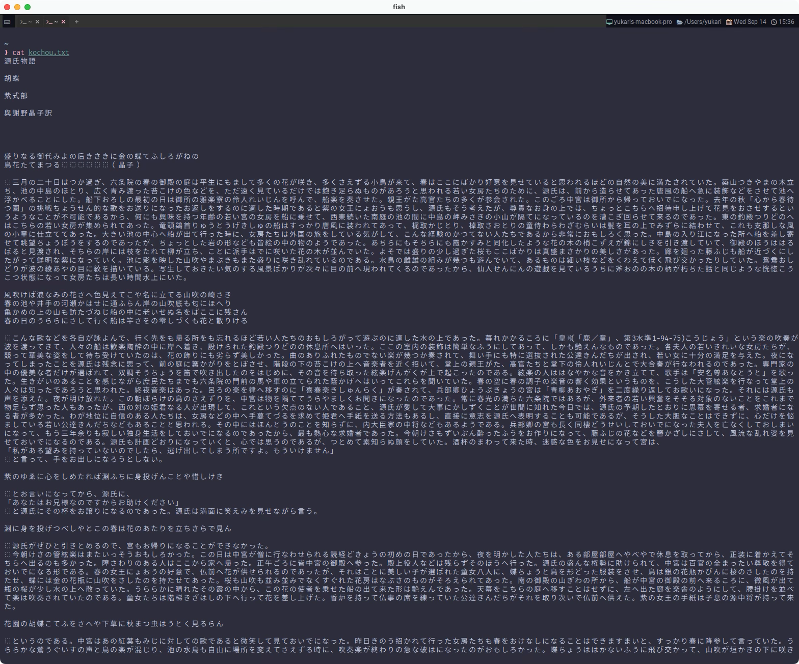

# Toggle Font

ここではわたしが使っている機能実装を紹介します。

環境によっては全く必要ないと思いますので、その場合はスキップしてください。

## まず前提

わたしのディスプレイ環境なんですが、MacBook と 4K を行ったり来たりして使っています。

だからなんだって言われるとキツイんですが、一番わかりやすいところでフォントサイズの問題があって、画面のスケールが違いすぎて 大きすぎたり小さすぎたりしてしまう...😢




```admonish note
意図伝わりますでしょうか...。

むしろツールバーをみてもらった方がわかりやすいかもしれません。アイコンとかフォントとか、サイズというか、スケール全然違うでしょ？
```

[DecreaseFontSize](https://wezfurlong.org/wezterm/config/lua/keyassignment/DecreaseFontSize.html)・
[IncreaseFontSize](https://wezfurlong.org/wezterm/config/lua/keyassignment/IncreaseFontSize.html)
を使ってサイズを上げ下げしてもいいんですが、ちょっとコレじゃない...。

わたしはこれが結構ストレスになっていたので、 この問題の解消に有用なのが次のフォント切り替え機能です。

## フォント切り替え

この例では`toggle-font-size`というイベントを独自に作っています。

フォントサイズに限らず、元の設定を直接変えるのではなく、オーバーライドする形式になっています。
```admonish info title="[window:get_config_overrides()](https://wezfurlong.org/wezterm/config/lua/window/get_config_overrides.html)"
Returns a copy of the current set of configuration overrides that is in effect for the window.

ウィンドウに適用されている設定オーバーライドの現在のセットのコピーを返します。
```

端的に言えば、オーバーライドされていない素の状態であれば、`font_size`を`10.0`でオーバーライドする。

オーバーライドされているのであれば、`font_size`を`nil`としてオーバーライドを無効化する(`14.0`に戻される)。

~~~admonish example title="event.lua"
```lua
local wezterm = require 'wezterm'

wezterm.on('toggle-font-size', function(window, pane)
  local overrides = window:get_config_overrides() or {}
  overrides.font_size = not overrides.font_size and 10.0 or nil

  window:set_config_overrides(overrides)
end)
```
~~~

これでフォントサイズの切り替えが実現できます。

~~~admonish note
ごめんなさい。わたしは`wezterm.lua`での素の`font_size`を`14.0`にしています。各自で調整してください。

(`14.0`と`10.0`を行ったり来たりできるように設定しています。)
~~~

独自イベントが呼び出されるようにするには`EmitEvent`を用います。

```admonish info title="[EmitEvent](https://wezfurlong.org/wezterm/config/lua/keyassignment/EmitEvent.html)"
This action causes the equivalent of wezterm.emit(name, window, pane) to be called in the context of the current pane.

このアクションは、現在のペインのコンテキストで wezterm.emit(name, window, pane) と同等のアクションが呼び出されるようにします。
```

今回はキーバインド`ctrl-f`をトリガーとして呼び出します。

~~~admonish example title="keybinds.lua"
```lua
  { key = 'f', mods = 'CTRL', action = act.EmitEvent 'toggle-font-size' },
```
~~~

まあ、思いっきり手動なんですけどね。自動で出来たら面白いんですけどね。

```admonish note
あれ？dpi取得できるなら自動で出来るのかな。このサイト作りながら気づいてしまった...。

アウトプットはしてみるものですね😆次のページに書いちゃいます。
```

素の状態: [^big]


切り替えた状態:


```admonish success
切り替えられましたね🤗

気持ちいい〜❗️
```

[^big]:さらにフォントサイズを大きくして説明用に誇張しています。が、まだなんか中途半端でしたね。
